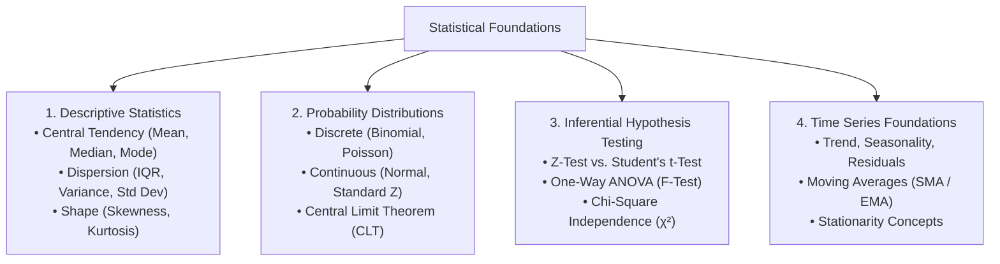

# Day 3: Comprehensive Statistics, Probability Distributions & Inferential Analysis

> **Target Course:** Data Analytics (PGCP-AI, C-DAC ACTS)  
> **Core Libraries:** `numpy`, `scipy.stats`, `pandas`, `statsmodels`, `matplotlib`, `seaborn`

---

## 📌 Syllabus Roadmap & Key Pillars



---

## 📖 1. Descriptive Statistics: Location, Spread & Shape

### 1.1 Measures of Central Tendency (Location)
- **Sample Mean ($\bar{x}$):** Arithmetic average. Sensitive to outliers.
  $$\bar{x} = \frac{1}{n}\sum_{i=1}^n x_i$$
- **Median ($Q_2$):** Middle value of an ordered dataset (50th percentile). Robust to extreme skewness and outliers.
- **Mode:** The most frequent observation. Useful for categorical and discrete distributions.

### 1.2 Measures of Dispersion (Spread)
- **Range:** $\text{Max} - \text{Min}$ (Heavily influenced by extrema).
- **Sample Variance ($s^2$):** Uses **Bessel’s correction ($n-1$)** to provide an unbiased estimator of the population variance $\sigma^2$:
  $$s^2 = \frac{1}{n-1}\sum_{i=1}^n (x_i - \bar{x})^2$$
- **Sample Standard Deviation ($s$):** Measure of spread in the original feature units:
  $$s = \sqrt{s^2} = \sqrt{\frac{1}{n-1}\sum_{i=1}^n (x_i - \bar{x})^2}$$
- **Interquartile Range (IQR):** Spread of the central 50% of the distribution:
  $$\text{IQR} = Q_3 - Q_1$$
- **Tukey Outlier Fences:**
  $$\text{Lower Bound} = Q_1 - 1.5 \times \text{IQR}, \quad \text{Upper Bound} = Q_3 + 1.5 \times \text{IQR}$$
- **Coefficient of Variation (CV):** Unitless measure of relative risk/dispersion:
  $$\text{CV} = \left(\frac{s}{\bar{x}}\right) \times 100\%$$

### 1.3 Measures of Shape (Moments)
- **3rd Moment — Skewness ($g_1$):** Measures distributional asymmetry.
  - *Symmetric ($g_1 = 0$):* $\text{Mean} \approx \text{Median} \approx \text{Mode}$.
  - *Positive / Right-Skewed ($g_1 > 0$):* Long right tail. $\text{Mean} > \text{Median} > \text{Mode}$.
  - *Negative / Left-Skewed ($g_1 < 0$):* Long left tail. $\text{Mean} < \text{Median} < \text{Mode}$.
- **4th Moment — Kurtosis ($g_2$):** Measures tail heaviness and outlier likelihood relative to a Gaussian bell curve.
  - *Mesokurtic (Normal):* $\text{Kurtosis} = 3$ (Excess Kurtosis $= 0$).
  - *Leptokurtic (Heavy tails, sharp peak):* $\text{Excess Kurtosis} > 0$. High risk of extreme black-swan outliers.
  - *Platykurtic (Light tails, flat shoulder):* $\text{Excess Kurtosis} < 0$.

---

## 🎲 2. Probability Theory & Distributions

### 2.1 Discrete Distributions
1. **Binomial Distribution:** Models the number of successes $k$ in $n$ independent Bernoulli trials with success probability $p$:
   $$P(X = k) = \binom{n}{k} p^k (1-p)^{n-k}$$
   - *Expected Value:* $E[X] = np$
   - *Variance:* $\text{Var}(X) = np(1-p)$
2. **Poisson Distribution:** Models the count of independent events occurring within a fixed interval of time or space at an average constant rate $\lambda$:
   $$P(X = k) = \frac{\lambda^k e^{-\lambda}}{k!}$$
   - *Expected Value & Variance:* $E[X] = \text{Var}(X) = \lambda$

### 2.2 Continuous Distributions
1. **Normal (Gaussian) Distribution:**
   $$f(x) = \frac{1}{\sigma\sqrt{2\pi}} \exp\left(-\frac{(x - \mu)^2}{2\sigma^2}\right)$$
   - **Empirical 68-95-99.7 Rule:**
     - $\mu \pm 1\sigma \approx 68.27\%$ of observations.
     - $\mu \pm 2\sigma \approx 95.45\%$ of observations.
     - $\mu \pm 3\sigma \approx 99.73\%$ of observations.
2. **Standard Normal ($Z$-Distribution):** Rescaling to $\mu = 0$ and $\sigma = 1$:
   $$Z = \frac{X - \mu}{\sigma}$$

### 2.3 Central Limit Theorem (CLT)
> Regardless of the initial population distribution (skewed, uniform, bimodal), the distribution of the sample means $\bar{X}$ converges to a Normal Distribution as sample size $n$ increases ($n \ge 30$).

- **Mean of Sampling Distribution:** $\mu_{\bar{x}} = \mu$
- **Standard Error of the Mean (SE):**
  $$\text{SE} = \sigma_{\bar{x}} = \frac{\sigma}{\sqrt{n}}$$

---

## 🔬 3. Inferential Statistics & Hypothesis Testing

### 3.1 Decision Framework
- **Null Hypothesis ($H_0$):** Status quo; no significant effect, difference, or relationship.
- **Alternative Hypothesis ($H_a$ or $H_1$):** Claim of a real effect or difference.
- **Significance Level ($\alpha$):** Threshold for Type I error (commonly $\alpha = 0.05$).
- **$p$-Value Decision Rule:**
  - If $p \le \alpha \implies$ **Reject $H_0$** (Statistically significant).
  - If $p > \alpha \implies$ **Fail to Reject $H_0$** (Insufficient evidence).

### 3.2 Testing Matrix

| Test Name | Typical Scenario | Test Statistic Formula | SciPy Function |
| :--- | :--- | :--- | :--- |
| **One-Sample $t$-Test** | Compare sample mean against known target $\mu_0$ ($\sigma$ unknown) | $t = \frac{\bar{x} - \mu_0}{s / \sqrt{n}}$ | `scipy.stats.ttest_1samp` |
| **Two-Sample Independent $t$-Test** | Compare means of 2 independent groups (e.g. Treatment vs Control) | $t = \frac{\bar{x}_1 - \bar{x}_2}{\sqrt{\frac{s_1^2}{n_1} + \frac{s_2^2}{n_2}}}$ | `scipy.stats.ttest_ind` |
| **One-Way ANOVA ($F$-Test)** | Compare means of $\ge 3$ groups simultaneously | $F = \frac{\text{Mean Square Between (MSB)}}{\text{Mean Square Within (MSW)}}$ | `scipy.stats.f_oneway` |
| **Chi-Square Test ($\chi^2$)** | Independence between 2 categorical features | $\chi^2 = \sum \frac{(O_i - E_i)^2}{E_i}$ | `scipy.stats.chi2_contingency` |
| **Pearson Correlation ($r$)** | Linear association between 2 continuous features | $r = \frac{\sum (x_i - \bar{x})(y_i - \bar{y})}{\sqrt{\sum(x_i - \bar{x})^2 \sum(y_i - \bar{y})^2}}$ | `scipy.stats.pearsonr` |

---

## 📈 4. Time Series Analysis Foundations

### 4.1 Classical Time Series Components
A time series $Y_t$ is decomposed into:
1. **Trend ($T_t$):** Long-term upward or downward directional movement.
2. **Seasonality ($S_t$):** Periodic, repetitive calendar-driven fluctuations (e.g., quarterly sales peaks).
3. **Cyclical ($C_t$):** Macro-economic multi-year cycles.
4. **Irregular / Residual ($R_t$ or $\epsilon_t$):** Unpredictable random white noise.

- **Additive Model:** $Y_t = T_t + S_t + R_t$ (Used when seasonal variations remain constant as trend rises).
- **Multiplicative Model:** $Y_t = T_t \times S_t \times R_t$ (Used when seasonal fluctuations grow proportionally with the trend).

### 4.2 Smoothing & Moving Averages
- **Simple Moving Average (SMA):** Smooths short-term fluctuations by averaging the last $k$ periods:
  $$\text{SMA}_t = \frac{1}{k}\sum_{i=0}^{k-1} Y_{t-i}$$
- **Stationarity Condition:** A stationary series has constant mean, constant variance, and autocovariance that depends only on the time lag ($h$). Evaluated via the **Augmented Dickey-Fuller (ADF)** test.

---

## 💻 Practical Code Lab: End-to-End Statistical Toolkit

Below is a complete, runnable script demonstrating all Day 3 statistical methods using NumPy, SciPy, and Pandas:

```python
"""
Day 3 Laboratory: Comprehensive Statistical Analysis Toolkit
Demonstrates:
1. Descriptive Statistics & 5-Number Summary
2. Probability Distributions (Normal & Binomial)
3. Hypothesis Testing: Two-Sample t-Test, One-Way ANOVA & Chi-Square
4. Time Series Smoothing (SMA)
"""

import numpy as np
import pandas as pd
from scipy import stats

print("=" * 65)
print("1. DESCRIPTIVE STATISTICS & SHAPE ANALYSIS")
print("=" * 65)

# Realistic customer transaction spending data
np.random.seed(42)
spending = np.array([25.0, 32.5, 45.0, 28.0, 35.0, 110.0, 42.0, 38.5, 29.0, 52.0])

mean_val = np.mean(spending)
median_val = np.median(spending)
std_val = np.std(spending, ddof=1)  # ddof=1 uses Bessel's n-1 correction
q1, q3 = np.percentile(spending, [25, 75])
iqr = q3 - q1
lower_fence = q1 - 1.5 * iqr
upper_fence = q3 + 1.5 * iqr

skew_val = stats.skew(spending)
kurt_val = stats.kurtosis(spending)  # Fisher excess kurtosis (Normal = 0)

print(f"Sample Mean       : ${mean_val:.2f}")
print(f"Sample Median     : ${median_val:.2f}")
print(f"Sample Std Dev    : ${std_val:.2f} (Bessel corrected ddof=1)")
print(f"IQR               : ${iqr:.2f} (Q1: ${q1:.2f}, Q3: ${q3:.2f})")
print(f"Outlier Fences    : [${lower_fence:.2f}, ${upper_fence:.2f}]")
print(f"Identified Outliers: {spending[(spending < lower_fence) | (spending > upper_fence)]}")
print(f"Skewness (3rd)    : {skew_val:.3f} (Right-skewed due to outlier)")
print(f"Excess Kurtosis   : {kurt_val:.3f} (Leptokurtic)")

print("\n" + "=" * 65)
print("2. PROBABILITY DISTRIBUTIONS & Z-SCORES")
print("=" * 65)

# Standard Normal Z-Score calculation
mu, sigma = 50.0, 10.0
raw_score = 65.0
z_score = (raw_score - mu) / sigma
prob_greater = 1.0 - stats.norm.cdf(z_score)
print(f"Raw Score: {raw_score} | Z-Score: {z_score:.2f}")
print(f"Probability of scoring > {raw_score}: {prob_greater:.4f} ({prob_greater*100:.2f}%)")

# Binomial Distribution: 10 ad clicks, probability of conversion p=0.2
# Find probability of exactly 3 conversions: P(X=3)
p_3_clicks = stats.binom.pmf(k=3, n=10, p=0.2)
print(f"Binomial P(X=3 conversions from 10 clicks, p=0.2): {p_3_clicks:.4f}")

print("\n" + "=" * 65)
print("3. INFERENTIAL HYPOTHESIS TESTING")
print("=" * 65)

# A. Two-Sample Independent t-Test (A/B Testing: Checkout page variant A vs B)
page_a = np.array([12.5, 14.2, 11.8, 13.0, 12.9, 14.5, 13.2])
page_b = np.array([15.1, 16.5, 14.8, 17.2, 15.9, 16.0, 15.5])

t_stat, p_val_t = stats.ttest_ind(page_a, page_b)
print(f"Two-Sample t-Test: t-statistic = {t_stat:.3f}, p-value = {p_val_t:.5f}")
if p_val_t < 0.05:
    print("Decision: Reject H0! Variant B significantly outperforms Variant A.")
else:
    print("Decision: Fail to reject H0.")

# B. One-Way ANOVA (Compare 3 marketing channels)
channel_email = [22, 25, 24, 26, 23]
channel_social = [30, 28, 32, 29, 31]
channel_search = [18, 19, 21, 20, 17]

f_stat, p_val_anova = stats.f_oneway(channel_email, channel_social, channel_search)
print(f"\nOne-Way ANOVA   : F-statistic = {f_stat:.3f}, p-value = {p_val_anova:.5e}")
if p_val_anova < 0.05:
    print("Decision: Reject H0! Significant difference exists across marketing channels.")

# C. Chi-Square Test of Independence (Gender vs. Subscription Preference)
# Table: [Basic, Premium]
contingency_table = np.array([
    [40, 60],  # Male
    [65, 35]   # Female
])
chi2, p_val_chi, dof, expected = stats.chi2_contingency(contingency_table)
print(f"\nChi-Square Test : chi2 = {chi2:.3f}, p-value = {p_val_chi:.5f}, dof = {dof}")
if p_val_chi < 0.05:
    print("Decision: Reject H0! Subscription preference is dependent on gender.")

print("\n" + "=" * 65)
print("4. TIME SERIES SMOOTHING (SIMPLE MOVING AVERAGE)")
print("=" * 65)

daily_sales = pd.Series([100, 112, 105, 120, 135, 128, 140, 152, 148, 160])
sma_3 = daily_sales.rolling(window=3).mean()

ts_df = pd.DataFrame({'Actual_Sales': daily_sales, '3_Day_SMA': sma_3})
print(ts_df)
print("=" * 65)
```
