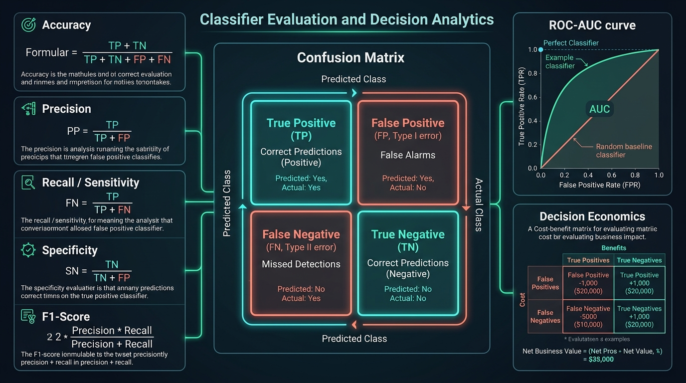
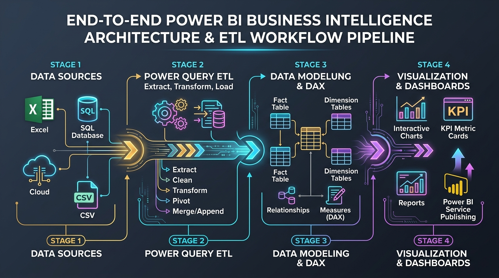

# C-DAC PGCP-AI: Data Analytics (August 2026)
> **Institution:** C-DAC ACTS, Pune  
> **Course:** Data Analytics (PGCP-AI)  
> **Total Duration:** 120 Hours (50 Theory + 50 Lab + 20 Self-Learning)  
> **Evaluation Scheme:** Theory (40%) | Lab (40%) | Internal Assessment (20%)

---

## 📌 Repository Overview

This repository contains the complete syllabus, structured module study notes, visual diagram infographics, mathematical formula cheat-sheets, and practical Python laboratory walkthroughs for the **Data Analytics** course under the Post Graduate Certificate Programme in Artificial Intelligence (PGCP-AI) at C-DAC ACTS, Pune.

---

## 📂 Repository Structure

```
├── 03_Data Analytics.pdf                      # Official syllabus document
├── syallabus.txt                              # Clean formatted syllabus (plain text)
├── syllabus.md                                # Detailed syllabus with hours breakdown (Markdown)
├── README.md                                  # Repository landing page and index
├── Day1/                                      # Advanced Python Foundations (Decorators, ABC, Generators)
├── Day2/                                      # NumPy ndarray Architecture, Vectorized Math & Pandas
├── cheat_sheets/                              # Comprehensive data science & Python PDF cheat sheets
└── notes/                                     # Comprehensive study guides and code labs
    ├── 00_rote_learning_and_mnemonics.md     # Exam tricks, mnemonics, and flashcards
    ├── 01_foundations_and_eda.md             # Sessions 1–4: Lifecycle, Setup, EDA & Visualization
    ├── 02_statistics_and_probability.md      # Sessions 5–12: Stats, Bayes, CLT, Hypothesis Testing
    ├── 03_predictive_and_prescriptive_analytics.md # Sessions 13–20: Decision Trees, OLS, Simulation
    ├── 04_evaluation_advanced_analytics_powerbi.md # Sessions 21–25: Validation, PCA, Power BI
    ├── README.md                              # Master study index & formula cheat-sheet
    └── images/                                # Generated high-res diagram infographics
        ├── mnemonics_exam_tricks.jpg
        ├── formulas_rote_card.jpg
        ├── exam_traps_and_hacks.jpg
        ├── lifecycle_infographic.jpg
        ├── probability_distributions.jpg
        ├── decision_trees_segmentation.jpg
        ├── classifier_evaluation_matrix.jpg
        └── powerbi_pipeline_architecture.jpg
```

---

## 📚 Study Modules & Curriculum Roadmap

| Module | Scope | Key Topics | Document Link |
| :---: | :---: | :--- | :---: |
| ⚡ | **Exam Cheatsheet** | "LINE" regression, "p is low, H0 must go", Skewness tail rule, formula recall cards | [00_rote_learning_and_mnemonics.md](notes/00_rote_learning_and_mnemonics.md) |
| **01** | **Sessions 1 – 4** | Business Analytics Lifecycle, Colab/Jupyter Setup, EDA, Matplotlib/Seaborn | [01_foundations_and_eda.md](notes/01_foundations_and_eda.md) |
| **02** | **Sessions 5 – 12** | Descriptive Statistics, Outliers (IQR/Z-Score), Bayes' Theorem, CLT, Z-Test, Chi-Square | [02_statistics_and_probability.md](notes/02_statistics_and_probability.md) |
| **03** | **Sessions 13 – 20** | Predictive Modeling, Information Gain, Decision Trees, OLS Regression, Optimization | [03_predictive_and_prescriptive_analytics.md](notes/03_predictive_and_prescriptive_analytics.md) |
| **04** | **Sessions 21 – 25** | Overfitting, Cross-Validation, Classifier Metrics (ROC-AUC), PCA, Power BI & DAX | [04_evaluation_advanced_analytics_powerbi.md](notes/04_evaluation_advanced_analytics_powerbi.md) |

---

## 🖼️ Visual Infographics Gallery

| Diagram Preview | Topic & Description |
| :--- | :--- |
|  | **Exam Mnemonics & Tricks:** LINE assumptions, hypothesis decision rule, skewness intuition |
|  | **Formulas Memory Card:** Variance (n-1), Tukey IQR, Bayes' rule, CLT SE, Entropy, F1 |
|  | **Exam Traps & Hacks:** r=0 trap, accuracy paradox, Power BI Column vs Measure |
|  | **Analytics Life Cycle:** Discovery ➔ Preparation ➔ Model Planning ➔ Building ➔ QA ➔ Deployment |
|  | **Distributions & CLT:** Normal, Binomial, Poisson + Central Limit Theorem convergence |
|  | **Decision Trees & Segmentation:** 2D feature partition, Information Gain, tree-to-rules |
|  | **Classifier Evaluation Matrix:** Confusion Matrix, Precision/Recall, ROC-AUC curve |
|  | **Power BI Pipeline:** Power Query ETL ➔ Star Schema Modeling ➔ DAX Measures ➔ Dashboards |

---

## 💻 Tech Stack & Prerequisites
- **Language:** Python 3.10+
- **Core Libraries:** NumPy, Pandas, SciPy, Scikit-learn, Matplotlib, Seaborn
- **BI Tool:** Microsoft Power BI Desktop
