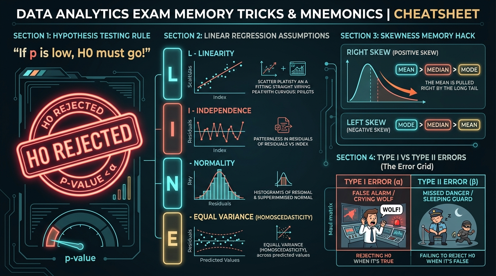
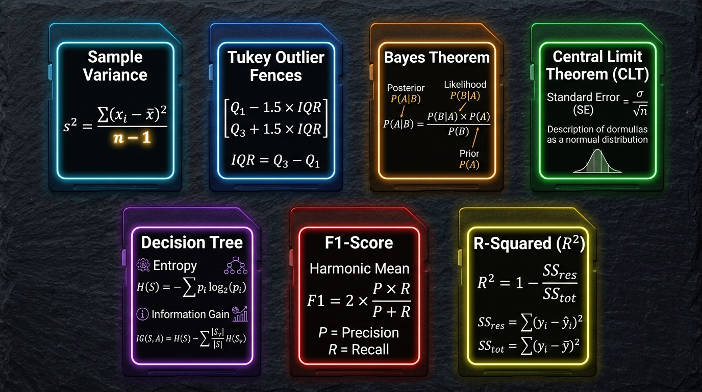
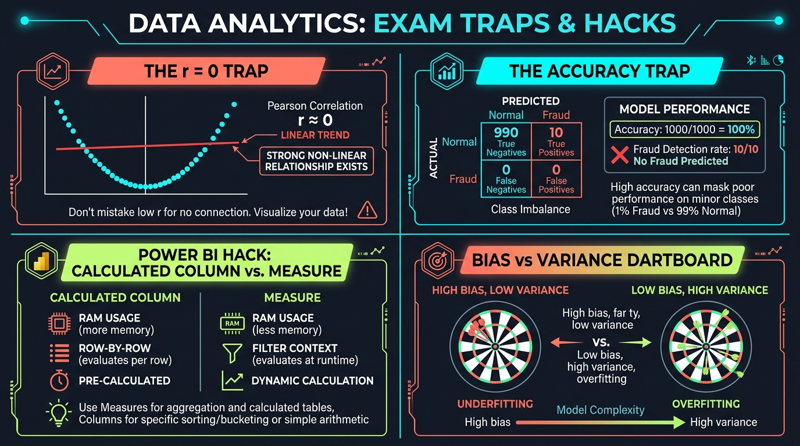

# Data Analytics: Exam Mnemonics, Tricks & Rote-Learning Cheatsheet
> **Target:** C-DAC PGCP-AI Data Analytics (August 2026)  
> **Purpose:** Rapid memorization, exam tricks, formula recall cards, and common viva traps.

---

## 🖼️ Memory Cards & Visual Cheatsheets

### 1. Mnemonics & Exam Tricks

### 2. Master Formulas Memory Card

### 3. Exam Traps & Conceptual Hacks

---

## ⚡ 1. Top 5 Exam Mnemonics (Must Rote-Learn)

### 🎯 Mnemonic 1: "If $p$ is low, $H_0$ must go!"
- **What it means:** When testing statistical hypotheses, if your calculated $p\text{-value} \le \alpha$ (significance level, usually $0.05$), you **REJECT the Null Hypothesis ($H_0$)**.
- **Memory Trigger:** 
  - *Small $p$ (e.g., $0.01 < 0.05$)* $\rightarrow$ **Reject $H_0$** (Significant evidence!).
  - *Large $p$ (e.g., $0.23 > 0.05$)* $\rightarrow$ **Fail to Reject $H_0$** (Not enough proof).

---

### 🎯 Mnemonic 2: The "LINE" Assumptions of Linear Regression
To use Ordinary Least Squares (OLS) Linear Regression, your data must pass the **LINE** tests:
| Letter | Assumption | Plain-English Meaning | How to Test in Exam / Lab |
| :---: | :--- | :--- | :--- |
| **L** | **Linearity** | The relationship between $X$ and $Y$ follows a straight line. | Scatter plot of $X$ vs. $Y$, or Residuals vs. Fitted plot. |
| **I** | **Independence** | Observations are independent; no time autocorrelation. | Durbin-Watson test statistic ($\approx 2.0$ means independent). |
| **N** | **Normality** | Residual errors $\epsilon$ follow a normal distribution. | Q-Q Plot, Shapiro-Wilk test, or histogram of residuals. |
| **E** | **Equal Variance** | Homoscedasticity: error spread remains constant across all $X$. | Residuals vs. Fitted scatter (must look like a random band, NOT a funnel). |

---

### 🎯 Mnemonic 3: Skewness — "The Mean Chases the Tail"
Extreme values pull the Mean in their direction, while the Mode stays at the highest peak and the Median stays in the center:
- **Right (Positive) Skew:**
  - Long tail stretches to the **Right** (e.g., Household Income, CEO Salaries).
  - The mean is dragged right:
    $$\mathbf{\text{Mean} > \text{Median} > \text{Mode}}$$
- **Left (Negative) Skew:**
  - Long tail stretches to the **Left** (e.g., Age at retirement, Human lifespan).
  - The mean is dragged left:
    $$\mathbf{\text{Mode} > \text{Median} > \text{Mean}}$$
- **Symmetrical (Normal):**
  $$\mathbf{\text{Mean} \approx \text{Median} \approx \text{Mode}}$$

---

### 🎯 Mnemonic 4: Type I vs. Type II Errors ("Wolf & Guard")
- **Type I Error ($\alpha$): The "Boy Who Cried Wolf" (False Alarm)**
  - You claim there is a wolf when there is NO wolf.
  - *Statistical definition:* Rejecting $H_0$ when $H_0$ is actually **TRUE**.
- **Type II Error ($\beta$): The "Sleeping Guard" (Missed Threat)**
  - A real wolf attacks, but the guard is asleep and says nothing.
  - *Statistical definition:* Failing to reject $H_0$ when $H_0$ is actually **FALSE**.

---

### 🎯 Mnemonic 5: Precision vs. Recall
- **Pre<u>c</u>ision:** Minimizes **<u>C</u>rap** (False Alarms / False Positives).
  $$\text{Precision} = \frac{TP}{TP + FP}$$
  *When to prioritize:* Email Spam filtering (don't send real emails to spam!).
- **Re<u>call</u>:** Ensures you **<u>Call</u> back** every single threat (Minimizes False Negatives).
  $$\text{Recall} = \frac{TP}{TP + FN}$$
  *When to prioritize:* Cancer detection, Fraud detection (never let a sick patient walk away undetected!).

---

## 📐 2. Essential Formulas to Memorize (Rote-Learning Table)

| Formula Name | Exact Mathematical Expression | Common Exam Mistake / Trap |
| :--- | :---: | :--- |
| **Sample Variance ($s^2$)** | $$s^2 = \frac{\sum (x_i - \bar{x})^2}{\mathbf{n - 1}}$$ | ⚠️ **Never divide by $n$** for sample variance! Dividing by $n-1$ (Bessel's correction) removes sample bias. |
| **Coefficient of Variation** | $$CV = \left(\frac{s}{\bar{x}}\right) \times 100\%$$ | ⚠️ Used to compare volatility between variables measured in completely different units (e.g., kg vs. cm). |
| **Tukey's IQR Outlier Fences** | $$\begin{aligned}\text{Lower} &= Q_1 - 1.5 \times \text{IQR} \\\ \text{Upper} &= Q_3 + 1.5 \times \text{IQR}\end{aligned}$$ | ⚠️ Remember: $\text{IQR} = Q_3 - Q_1$. Values strictly outside these fences are classified as outliers. |
| **Central Limit Theorem SE** | $$SE = \frac{\sigma}{\sqrt{n}}$$ | ⚠️ As sample size $n$ increases by $4\times$, the Standard Error drops by half ($2\times$). |
| **Bayes' Theorem** | $$P(A\|B) = \frac{P(B\|A) \cdot P(A)}{P(B)}$$ | ⚠️ $P(B) = P(B\|A)P(A) + P(B\|\neg A)P(\neg A)$ (Total probability denominator). |
| **Decision Tree Entropy** | $$H(S) = -\sum_{i=1}^c p_i \log_2(p_i)$$ | ⚠️ Binary: If 50/50 split, $H = 1.0$ (Max impurity). If 100/0 split, $H = 0.0$ (Pure). |
| **Information Gain** | $$IG(S, A) = H(S) - \sum \frac{\|S_v\|}{\|S\|} H(S_v)$$ | ⚠️ Always choose the feature with the **highest** Information Gain to split on! |
| **Harmonic Mean (F1-Score)** | $$F1 = 2 \times \frac{\text{Precision} \times \text{Recall}}{\text{Precision} + \text{Recall}}$$ | ⚠️ Why Harmonic Mean? It heavily penalizes extreme imbalances between Precision and Recall. |
| **Coefficient of Determination** | $$R^2 = 1 - \frac{SS_{\text{res}}}{SS_{\text{tot}}}$$ | ⚠️ $R^2 \le 1.0$. Adjusted $R^2$ is always $\le R^2$. |

---

## 🚫 3. Critical Exam Traps to Avoid

### ⚠️ Trap 1: "Correlation $r = 0$ means no relationship"
- **WRONG:** Pearson's correlation only measures **linear** relationships!
- If $Y = X^2$ (a perfect parabola), $r \approx 0.0$, but $Y$ is completely determined by $X$.
- *Viva Answer:* "A zero correlation only proves absence of linear association; non-linear dependencies may still exist."

### ⚠️ Trap 2: The "High Accuracy" Trap on Imbalanced Data
- If $99\%$ of credit card transactions are genuine and $1\%$ are fraudulent:
- A stupid model predicting "GENUINE" for every transaction achieves **$99\%$ accuracy**, yet catches **$0\%$ of fraud**.
- *Always evaluate:* **Precision**, **Recall**, and **ROC-AUC** when data is imbalanced!

### ⚠️ Trap 3: Power BI — Calculated Column vs. Measure
| Dimension | Calculated Column | DAX Measure |
| :--- | :--- | :--- |
| **When is it calculated?** | During Data Refresh (Static) | On the fly when interacting with visuals (Dynamic) |
| **Where is it stored?** | **RAM / Memory** (Takes up RAM space) | **Zero RAM** (Calculated via CPU on demand) |
| **Evaluation Context** | **Row Context** (Evaluates row-by-row) | **Filter Context** (Evaluates across active visual slicers) |
| **Rule of Thumb** | Use ONLY for slicing, categorizing, or bucketing | Use for **ALL** aggregations, sums, averages, and ratios |

### ⚠️ Trap 4: Bias vs. Variance
- **High Bias (Underfitting):** Model is like a rigid ruler trying to fit a circle. Misses the underlying trend. High training error, high testing error.
- **High Variance (Overfitting):** Model is like silly putty memorizing every grain of noise. Near-zero training error, terrible testing error.
- **Goal:** Sweet spot minimizing Total Error $= \text{Bias}^2 + \text{Variance} + \text{Irreducible Noise}$.

---

## 📝 Rapid Self-Test Flashcards (Check Your Memory)

1. **What is Bessel's correction in variance calculation?**
   - *Answer:* Dividing by $(n - 1)$ instead of $n$ when computing sample variance to provide an unbiased estimator of population variance.
2. **If $P(A) = 0.2$ and $P(B|A) = 0.6$, what is the joint probability $P(A \cap B)$?**
   - *Answer:* $P(A \cap B) = P(A) \times P(B|A) = 0.2 \times 0.6 = 0.12$.
3. **What does the area under an ROC curve (AUC) of 0.5 represent?**
   - *Answer:* Random guessing (coin flip). A perfect classifier has $\text{AUC} = 1.0$.
4. **Which Power BI schema is best for performance: Star Schema or Snowflake Schema?**
   - *Answer:* **Star Schema** (Fact table in center directly connected to denormalized Dimension tables with 1-to-many relationships).
