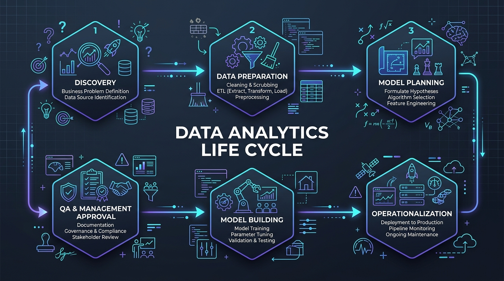
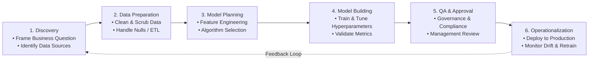

# Module 1: Foundations & Exploratory Data Analysis
> **Sessions Covered:** Sessions 1, 2, 3, 4  
> **Total Time:** 10T + 10L + 8SL = 28 Hours  
> **Target Course:** Data Analytics (PGCP-AI, C-DAC ACTS)

---

## 📌 High-Yield "Nano" Takeaways (Exam Rapid-Recall)
- **Business Analytics vs. Reporting:** Reporting tells you *what happened* (historical, passive); Analytics tells you *why it happened, what will happen, and what should be done* (forward-looking, actionable).
- **The 6-Phase Lifecycle:** Discovery ➔ Data Preparation ➔ Model Planning ➔ Model Building ➔ QA & Governance ➔ Operationalization. Data Preparation consumes ~70-80% of project time.
- **EDA Golden Rule:** Always inspect data types (`.dtypes`, `.info()`), check for missingness (`.isnull().sum()`), examine 5-number summary (`.describe()`), and plot distributions before running any modeling algorithm.
- **Core Visualization Pairs:**
  - *Continuous Distribution:* Histogram + KDE (`sns.histplot`) or Boxplot (`sns.boxplot`).
  - *Categorical vs. Numeric:* Barplot (`sns.barplot`) or Violinplot (`sns.violinplot`).
  - *Bivariate Relationships:* Scatterplot (`sns.scatterplot`) + Correlation Heatmap (`sns.heatmap`).

---

## 🖼️ Architectural Diagram: The Data Analytics Life Cycle





---

## 📖 Deep-Dive Theory & Conceptual Walkthrough

### Session 1: Introduction to Business Analytics & The Project Lifecycle
*(Hours: 2 Theory + 2 Lab + 1 Self-Learning)*

#### 1. What is Business Analytics?
Business Analytics is the systematic mathematical, statistical, and computational exploration of enterprise data to extract predictive and prescriptive insights.
- **Descriptive Analytics:** *"How many items did we sell last quarter?"* (Summaries, Dashboards, Aggregations)
- **Predictive Analytics:** *"Which customers are at risk of churning next month?"* (Regression, Classification, Time Series)
- **Prescriptive Analytics:** *"What discount coupon should we offer to maximize profit while retaining customers?"* (Optimization, Simulation, Decision Science)

#### 2. Real-World Case Studies
- **E-Commerce Churn Prevention:** Predicting which high-value subscribers haven't visited in 14 days and automatically triggering personalized incentives.
- **Predictive Maintenance in Manufacturing:** Monitoring vibration and temperature sensor logs on turbines to predict bearing failure 48 hours in advance, avoiding factory downtime.

#### 3. Detailed Breakdown of the 6-Phase Analytics Lifecycle
1. **Discovery (Problem Definition):**
   - Define the business objective (e.g., reduce customer churn by 5%).
   - Identify constraints, stakeholder KPIs, and accessible data sources.
2. **Data Preparation (ETL & Wrangling):**
   - Extract data from data warehouses (SQL), API endpoints, or CSV logs.
   - Clean dirty data: deal with missing records, parse timestamps, remove duplicates.
3. **Model Planning:**
   - Explore correlation and feature relationships.
   - Formulate hypotheses; decide between classification, regression, or clustering.
4. **Model Building:**
   - Split dataset into Train and Test subsets (e.g., 80/20).
   - Fit candidate algorithms (Decision Trees, Logistic Regression, Random Forest).
5. **Quality Assurance, Documentation & Management Approval:**
   - Check compliance, data governance, and edge-case behavior.
   - Produce executive summaries for C-suite and risk teams.
6. **Acceptance, Operationalization & Operation:**
   - Deploy as a REST API microservice or batch inference pipeline.
   - Track data drift and performance decay over time.

---

### Session 2: Environment Setup, Computational Core & Statistical Foundations (NumPy & Pandas)
*(Hours: 2 Theory + 2 Lab + 1 Self-Learning)*

#### 1. Environment Setup & Workspace Configuration
- **Virtual Environment Isolation:** Setting up dedicated Python virtual environments (`python -m venv cdacvenv`) prevents package conflicts and guarantees reproducibility across different development workstations.
- **Core Scientific Stack:** Installation and version pinning of `numpy`, `pandas`, `matplotlib`, `seaborn`, and `scikit-learn` via `requirements.txt`.
- **Execution Environments:** Jupyter Notebooks and Google Colab for rapid exploratory analysis vs. standalone modular Python scripts for production pipelines.

#### 2. The Computational Core: NumPy ndarray Architecture
- **Memory Layout & Contiguity:** Unlike standard Python lists (which store pointers to arbitrary heap objects), NumPy `ndarray` objects store data in homogeneous, contiguous C-order or Fortran-order memory blocks.
- **CPU Cache Locality & SIMD:** Contiguous storage allows vector registers (AVX/SSE) to execute mathematical operations in parallel, operating up to 50x faster than native Python loops.
- **Zero-Copy Slicing vs. Copies:** Basic slicing (`array[start:stop:step]`) creates a **view** sharing the underlying memory buffer (`np.may_share_memory() == True`). Advanced/fancy indexing (using integer index arrays or boolean masks) allocates a brand new memory copy.
- **Type Precision (`dtype`):** Fixed bit-width representation (`int32`, `float64`, etc.) eliminates dynamic type-checking overhead during execution.

#### 3. Vectorized Mathematics & Statistical Moments
- **Vectorized Arithmetic & Ufuncs:** Element-wise broadcasting and universal functions (`ufuncs` like `np.add`, `np.subtract`, `np.multiply`, `np.divide`, `np.exp`, `np.log`).
- **Memory Buffer Re-use:** Using the `out=` parameter (e.g., `np.multiply(a, scalar, out=buffer)`) to prevent unnecessary intermediate memory allocations in large-scale data workflows.
- **Statistical Moments in Analytics:**
  - **1st Moment (Mean / Central Tendency):** 
    $$\mu = \frac{1}{N}\sum_{i=1}^{N} x_i$$
  - **2nd Moment (Variance & Standard Deviation / Dispersion):**
    $$\sigma^2 = \frac{1}{N}\sum_{i=1}^{N}(x_i - \mu)^2, \quad \sigma = \sqrt{\sigma^2}$$
  - **Standardization (Z-Score Normalization):** Rescaling feature distributions to zero mean ($\mu=0$) and unit variance ($\sigma=1$):
    $$z = \frac{x - \mu}{\sigma}$$
  - **3rd Moment (Skewness):** Quantifies distributional asymmetry (left/negative vs. right/positive tail).
  - **4th Moment (Kurtosis):** Measures tail heaviness and outlier likelihood relative to a Gaussian bell curve.

#### 4. Linear Algebra & Broadcasting Mechanics
- **Dot Products & Matrix Multiplication:** Inner products (`np.dot(a, b)`), matrix multiplication using the `@` operator (`A @ B`), and multidimensional contractions using Einstein summation notation (`np.einsum('ij,jk->ik', A, B)`).
- **Rank Preservation & Expansion:** Using `np.newaxis` or `None` to elevate 1D vectors of shape `(N,)` to 2D column matrices `(N, 1)` or row matrices `(1, N)`.
- **Broadcasting Rules:** Two dimensions are compatible when:
  1. They are equal, OR
  2. One of them is $1$.

#### 5. Tabular Abstraction: Pandas Foundations
- **`pd.Series` (1D):** Labeled one-dimensional array capable of holding any data type, featuring index alignment, vectorized aggregation (`.sum()`, `.mean()`, `.std()`, `.var()`), and custom key mapping.
- **`pd.DataFrame` (2D):** Two-dimensional heterogeneous tabular data structure with labeled axes (rows and columns).
- **Structural Inspection Tools:**
  - `df.info()`: Inspects memory usage, column non-null counts, and storage dtypes.
  - `df.describe()`: Generates the 5-number summary and parametric statistics (mean, std, percentiles) across numeric features.

---

### Session 3: Intelligent Data Analysis & The Modern Tooling Ecosystem
*(Hours: 2 Theory + 2 Lab + 2 Self-Learning)*

#### 1. Understanding the Nature of Data
- **Structured Data:** Tabular rows and columns (SQL tables, CSVs, Excel).
- **Semi-Structured Data:** Hierarchical key-value pairs (JSON, XML, NoSQL documents).
- **Unstructured Data:** Free-form text, audio, video streams, image files.
- **Scales of Measurement:**
  - *Nominal:* Categories with no intrinsic order (e.g., City, Gender, Product Category).
  - *Ordinal:* Ordered categories where interval between values is undefined (e.g., Survey Rating: Poor, Fair, Good, Excellent).
  - *Interval:* Ordered numeric values where distance is meaningful but no true zero exists (e.g., Temperature in Celsius).
  - *Ratio:* Numeric values with a true zero point allowing multiplication/division (e.g., Revenue, Age, Weight, Distance).

#### 2. Analysis vs. Reporting
| Dimension | Traditional Reporting | Intelligent Data Analysis |
| :--- | :--- | :--- |
| **Primary Question** | *"What happened?"* | *"Why did it happen and what will happen?"* |
| **Orientation** | Backward-looking (Historical) | Forward-looking & Prescriptive |
| **Output** | Static tables, PDF summaries | Interactive models, automated decision triggers |
| **Human Role** | Human manually inspects numbers | Algorithms uncover non-obvious patterns |

---

### Session 4: Exploratory Data Analysis (EDA) & Data Visualization
*(Hours: 2 Theory + 2 Lab + 2 Self-Learning)*

Exploratory Data Analysis (EDA) is the detective phase of Data Analytics pioneered by John Tukey. Before training any model, EDA reveals data shape, skewness, outliers, anomalies, and underlying correlations.

#### Key Principles of Visual Insight
1. **Match Visual to Variable Types:**
   - 1 Continuous Variable: Histogram with KDE curve or Boxplot.
   - 1 Categorical Variable: Count plot or Horizontal Bar chart.
   - 2 Continuous Variables: Scatter plot with regression trendline.
   - 1 Categorical + 1 Continuous: Boxplot or Violin plot across categories.
   - Multiple Continuous Variables: Correlation matrix heatmap.
2. **Avoid Chart Junk:** Maintain high data-to-ink ratio; avoid 3D bar charts, misleading truncated axes, and unreadable color schemes.

---

## 💻 Practical Code Lab: End-to-End Environment Setup & EDA

Below is a complete, runnable script demonstrating the practical skills for Sessions 1–4 using Pandas, NumPy, Matplotlib, and Seaborn on a realistic e-commerce customer dataset.

```python
"""
Sessions 1-4 Lab: Workspace Setup, Data Ingestion, and Exploratory Data Analysis
Prerequisites: pip install numpy pandas matplotlib seaborn scikit-learn
"""
import numpy as np
import pandas as pd
import matplotlib.pyplot as plt
import seaborn as sns

# Set visual styling
sns.set_theme(style="whitegrid", palette="muted")
plt.rcParams['figure.figsize'] = (10, 5)

# 1. Synthesize Realistic Business Data (E-commerce Transactions)
np.random.seed(42)
n_records = 500

data = {
    'CustomerID': range(1001, 1001 + n_records),
    'Age': np.random.randint(18, 70, size=n_records),
    'AnnualIncome_k$': np.random.normal(65, 20, size=n_records).round(1),
    'SpendingScore_1to100': np.random.randint(1, 100, size=n_records),
    'MembershipTier': np.random.choice(['Bronze', 'Silver', 'Gold', 'Platinum'], 
                                       size=n_records, p=[0.4, 0.3, 0.2, 0.1]),
    'Churned': np.random.choice([0, 1], size=n_records, p=[0.75, 0.25])
}

df = pd.DataFrame(data)

# Inject controlled missing values and outliers to simulate real-world data
df.loc[np.random.choice(df.index, 10), 'AnnualIncome_k$'] = np.nan
df.loc[0, 'AnnualIncome_k$'] = 250.0  # High outlier

print("=== 1. DATA OVERVIEW & TYPES ===")
print(df.info())

print("\n=== 2. DESCRIPTIVE STATISTICS (5-NUMBER SUMMARY) ===")
print(df.describe().T[['mean', 'std', 'min', '25%', '50%', '75%', 'max']])

# 2. Handle Missing Values (Data Preparation Phase)
income_median = df['AnnualIncome_k$'].median()
df['AnnualIncome_k$'] = df['AnnualIncome_k$'].fillna(income_median)
print(f"\nImputed missing AnnualIncome values with median: ${income_median:.1f}k")

# 3. Exploratory Visualizations
fig, axes = plt.subplots(1, 3, figsize=(18, 5))

# Plot A: Income Distribution (Histogram + KDE)
sns.histplot(df['AnnualIncome_k$'], kde=True, ax=axes[0], color='teal')
axes[0].set_title('Income Distribution with Outlier')
axes[0].set_xlabel('Annual Income ($k)')

# Plot B: Spending Score by Membership Tier (Categorical vs Numeric)
order = ['Bronze', 'Silver', 'Gold', 'Platinum']
sns.boxplot(data=df, x='MembershipTier', y='SpendingScore_1to100', order=order, ax=axes[1])
axes[1].set_title('Spending Score Distribution by Tier')

# Plot C: Bivariate Scatter & Churn Segmentation
sns.scatterplot(
    data=df, 
    x='AnnualIncome_k$', 
    y='SpendingScore_1to100', 
    hue='Churned', 
    style='Churned', 
    palette={0: '#2b83ba', 1: '#d7191c'},
    ax=axes[2]
)
axes[2].set_title('Income vs. Spending Score (Hue: Churned)')

plt.tight_layout()
plt.savefig('eda_overview_plot.png', dpi=150)
print("\nGenerated and saved 'eda_overview_plot.png'.")
```

---

## 🎯 Lab Exam & Viva Questions
1. **Q:** *Why do we prefer median imputation over mean imputation for skewed datasets?*  
   **A:** The mean is sensitive to extreme outliers, which pull it towards the tail. The median is a resistant measure of location representing the 50th percentile, preserving central tendency without distortion.
2. **Q:** *What is the difference between univariate and bivariate analysis?*  
   **A:** Univariate examines the properties and distribution of a single feature in isolation (e.g. histogram of Age). Bivariate investigates relationships, correlations, and dependencies between two features (e.g. scatter plot of Income vs. Spending).
3. **Q:** *What role does Data Governance play in the QA stage of the Analytics Lifecycle?*  
   **A:** It ensures data privacy compliance (GDPR/DPDP), data lineage tracking, algorithmic fairness/bias prevention, and reproducibility before business adoption.
