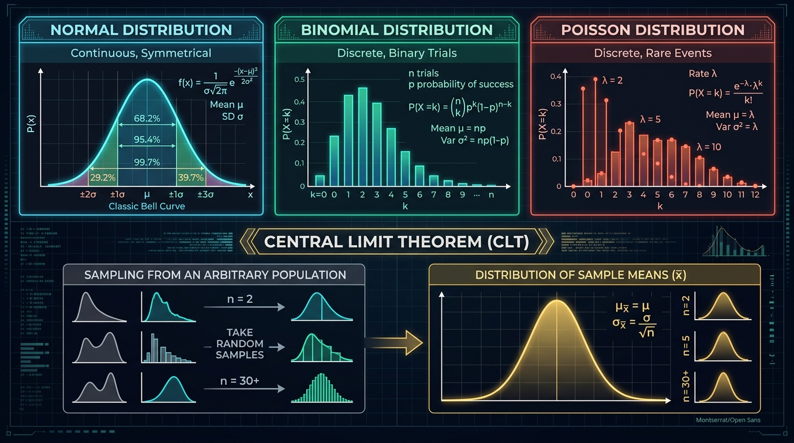
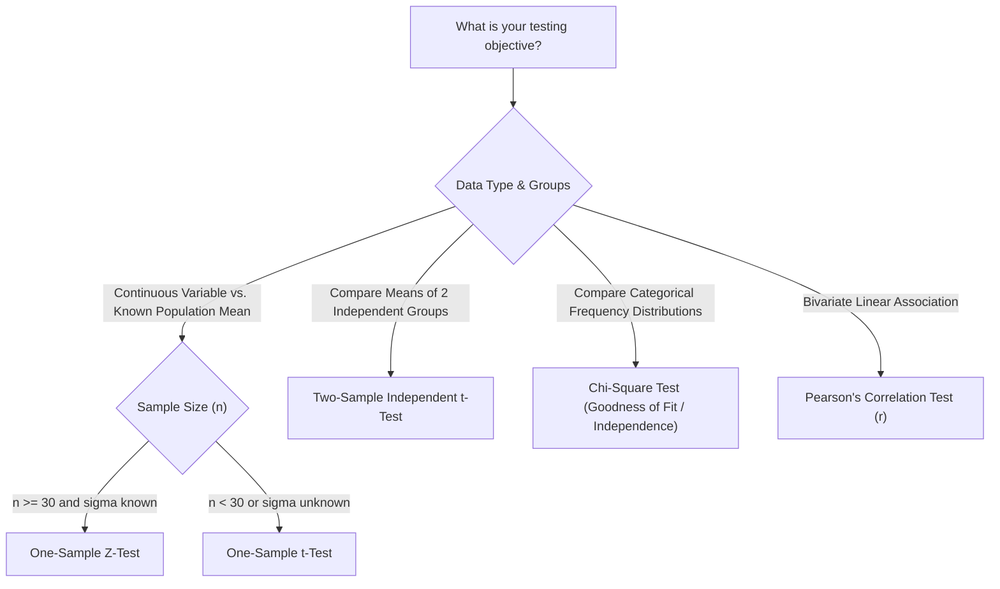

# Module 2: Statistical Methods & Probability Foundations
> **Sessions Covered:** Sessions 5, 6, 7, 8, 9, 10, 11, 12  
> **Total Time:** 16T + 16L + 8SL = 40 Hours  
> **Target Course:** Data Analytics (PGCP-AI, C-DAC ACTS)

---

## 📌 High-Yield "Nano" Takeaways (Exam Rapid-Recall)
- **Central Tendency Robustness:** For symmetric distributions, $\text{Mean} \approx \text{Median} \approx \text{Mode}$. For right-skewed distributions, $\text{Mean} > \text{Median} > \text{Mode}$.
- **Dispersion Metrics:**
  - $\text{Variance } (\sigma^2) = \frac{\sum (x_i - \mu)^2}{N}$
  - $\text{Standard Deviation } (\sigma) = \sqrt{\sigma^2}$ (same units as original data)
  - $\text{Coefficient of Variation } (CV) = \frac{\sigma}{\mu} \times 100\%$ (unitless, compares volatility across different scales).
- **Outlier Rule (Tukey's IQR Fence):**
  $$\text{Lower Bound} = Q_1 - 1.5 \times \text{IQR}, \quad \text{Upper Bound} = Q_3 + 1.5 \times \text{IQR}$$
  Values outside these boundaries are potential outliers.
- **Central Limit Theorem (CLT):** Given any population with mean $\mu$ and standard deviation $\sigma$ (regardless of shape), the distribution of sample means $\bar{X}$ approaches a Normal distribution $\mathcal{N}\left(\mu, \frac{\sigma}{\sqrt{n}}\right)$ as sample size $n \ge 30$.
- **Hypothesis Testing Decision Rule:**
  - If $p\text{-value} \le \alpha$ (typically $0.05$): **Reject $H_0$** (Statistically significant finding).
  - If $p\text{-value} > \alpha$: **Fail to reject $H_0$** (Insufficient evidence).
  - *Type I Error ($\alpha$):* False Positive (convicting an innocent person).
  - *Type II Error ($\beta$):* False Negative (letting a guilty person walk free).

---

## 🖼️ Architectural Diagram: Probability Distributions & CLT





---

## 📖 Deep-Dive Theory & Conceptual Walkthrough

### Session 5: Descriptive Statistics (Location & Dispersion)
*(Hours: 2 Theory + 2 Lab + 2 Self-Learning)*

#### 1. Measures of Location (Central Tendency)
- **Mean:** The arithmetic average. Highly susceptible to extreme values.
- **Median:** The middle value of sorted data (50th percentile). Resistant to outliers.
- **Mode:** The most frequently occurring observation. Useful for categorical data.

#### 2. Measures of Dispersion (Spread)
- **Range:** $\text{Max} - \text{Min}$. Primitive, captures only extrema.
- **Interquartile Range (IQR):** $Q_3 - Q_1$ (middle 50% of the distribution). Unaffected by extreme tails.
- **Standard Deviation & Variance:** Measures how tightly or loosely values cluster around the mean.
- **Coefficient of Variation (CV):**
  $$\text{CV} = \left(\frac{s}{\bar{x}}\right) \times 100\%$$
  *Example:* A stock with price \$100 and standard deviation \$10 ($CV = 10\%$) is far more stable than a penny stock at \$1 with standard deviation \$0.50 ($CV = 50\%$).

---

### Sessions 6 & 7: Sampling & Probability Foundations
*(Hours: 4 Theory + 4 Lab + 2 Self-Learning)*

#### 1. Sample vs. Population
- **Population ($N$):** The complete collection of all elements under study (e.g., all 1.4 billion citizens). Parameters are denoted by Greek letters ($\mu, \sigma$).
- **Sample ($n$):** A representative subset drawn from the population. Statistics are denoted by Latin letters ($\bar{x}, s$).
- **Sampling Methods:**
  - *Simple Random Sampling (SRS):* Every individual has an equal probability of selection.
  - *Stratified Sampling:* Divide population into homogeneous subgroups (strata, e.g., age brackets) and sample proportionally from each.
  - *Cluster Sampling:* Divide population into heterogeneous geographic clusters, randomly pick entire clusters.
  - *Re-sampling (Bootstrapping):* Drawing repeated samples with replacement from the existing sample to estimate confidence intervals.

#### 2. Probability Rules & Bayes' Theorem
- **Marginal Probability:** $P(A)$ — Probability of event $A$ occurring independently.
- **Joint Probability:** $P(A \cap B) = P(A) \times P(B|A)$ — Probability of both $A$ and $B$ occurring.
- **Conditional Probability:** $P(A|B) = \frac{P(A \cap B)}{P(B)}$ — Probability of $A$ given that event $B$ has already occurred.
- **Bayes' Theorem Formula:**
  $$P(A|B) = \frac{P(B|A) \cdot P(A)}{P(B)}$$
  Where:
  - $P(A)$ is the **Prior Probability** (initial belief before evidence).
  - $P(B|A)$ is the **Likelihood** of observing evidence $B$ if hypothesis $A$ is true.
  - $P(B)$ is the **Marginal Evidence** ($P(B|A)P(A) + P(B|\neg A)P(\neg A)$).
  - $P(A|B)$ is the **Posterior Probability** (updated belief after evidence).

*Medical Diagnosis Example:*
A rare disease affects $1\%$ of the population ($P(D) = 0.01$). A test is $95\%$ accurate ($P(+|D) = 0.95$) with a $5\%$ false-positive rate ($P(+|\neg D) = 0.05$). If a patient tests positive:
$$P(D|+) = \frac{0.95 \times 0.01}{(0.95 \times 0.01) + (0.05 \times 0.99)} = \frac{0.0095}{0.0095 + 0.0495} \approx 16.1\%$$
Even with a $95\%$ accurate test, the probability of truly having the disease is only $\approx 16\%$ because the base rate is so low!

---

### Session 8: Random Variables, Distributions & The CLT
*(Hours: 2 Theory + 2 Lab + 2 Self-Learning)*

#### 1. Discrete vs. Continuous Random Variables
- **Discrete:** Takes countable separate values (e.g., number of defective items, coin tosses).
- **Continuous:** Takes any value within an uninterrupted continuous range (e.g., customer height, transaction amount).

#### 2. Key Statistical Distributions
1. **Binomial Distribution:**
   - Models the number of successes $k$ in $n$ independent binary trials with success probability $p$.
   - Formula: $P(X=k) = \binom{n}{k} p^k (1-p)^{n-k}$
   - Mean $\mu = np$, Variance $\sigma^2 = np(1-p)$.
2. **Poisson Distribution:**
   - Models the number of rare events occurring in a fixed interval of time or space with average arrival rate $\lambda$.
   - Formula: $P(X=k) = \frac{\lambda^k e^{-\lambda}}{k!}$
   - Mean $\mu = \lambda$, Variance $\sigma^2 = \lambda$.
3. **Normal (Gaussian) Distribution:**
   - Continuous, symmetric, bell-shaped distribution governed by $\mu$ and $\sigma$.
   - **Empirical Rule (68-95-99.7):**
     - $68.2\%$ of values lie within $\mu \pm 1\sigma$
     - $95.4\%$ of values lie within $\mu \pm 2\sigma$
     - $99.7\%$ of values lie within $\mu \pm 3\sigma$

---

### Sessions 9 & 10: Estimation, Correlation, Covariance & Outliers
*(Hours: 4 Theory + 4 Lab)*

#### 1. Covariance vs. Correlation
- **Covariance ($Cov(X, Y)$):** Measures the directional linear association between two variables.
  $$Cov(X, Y) = \frac{\sum (X_i - \bar{X})(Y_i - \bar{Y})}{n - 1}$$
  *Limitation:* Scale-dependent (e.g. converting dollars to cents multiplies covariance by 100).
- **Pearson Correlation Coefficient ($r$):** Normalized covariance scaled between $-1$ and $+1$.
  $$r = \frac{Cov(X, Y)}{s_X \cdot s_Y}$$
  - $r = +1$: Perfect positive linear correlation.
  - $r = 0$: No linear relationship (variables may still have non-linear dependence!).
  - $r = -1$: Perfect negative linear correlation.

#### 2. Outlier Detection & Treatment
- **Z-Score Method:** $Z = \frac{x - \mu}{\sigma}$. Observations with $|Z| > 3$ are typically flagged as outliers.
- **Treatment Options:** Trimming (deletion), Winsorization (capping at 5th/95th percentiles), or logarithmic transformation to compress long tails.

---

### Sessions 11 & 12: Hypothesis Testing & Skewness
*(Hours: 4 Theory + 4 Lab + 2 Self-Learning)*

#### 1. Hypothesis Testing Framework
1. **State Hypotheses:**
   - Null Hypothesis ($H_0$): Status quo, no effect, or no difference ($\mu = \mu_0$).
   - Alternative Hypothesis ($H_1$): What the researcher aims to prove ($\mu \ne \mu_0$, or $\mu > \mu_0$).
2. **Select Significance Level ($\alpha$):** Standard is $\alpha = 0.05$ (5% risk of false positive).
3. **Calculate Test Statistic & $p$-Value:**
   - **Z-Score Formula:**
     $$Z = \frac{\bar{X} - \mu_0}{\sigma / \sqrt{n}}$$
   - **Chi-Square ($\chi^2$) Formula:**
     $$\chi^2 = \sum \frac{(O_i - E_i)^2}{E_i}$$
     where $O_i$ = Observed frequency, $E_i$ = Expected frequency.
4. **Make Decision:** Reject $H_0$ if $p \le \alpha$.

#### 2. Skewness and Kurtosis
- **Skewness:** Measures asymmetry of distribution.
  - Skewness $= 0$: Symmetric.
  - Skewness $> 0$: Right-skewed (positive, long tail on right, Mean > Median).
  - Skewness $< 0$: Left-skewed (negative, long tail on left, Mean < Median).
- **Kurtosis:** Measures tail heaviness and peak sharpness (Mesokurtic $= 3$, Leptokurtic $> 3$, Platykurtic $< 3$).

---

## 💻 Practical Code Lab: Statistical Testing & Outliers with Python

```python
"""
Sessions 5-12 Lab: Descriptive Stats, Outlier Detection, CLT, and Hypothesis Testing
Prerequisites: pip install numpy pandas scipy statsmodels matplotlib
"""
import numpy as np
import pandas as pd
from scipy import stats
import matplotlib.pyplot as plt

np.random.seed(42)

# ==========================================
# 1. OUTLIER DETECTION VIA IQR & Z-SCORE
# ==========================================
salaries = np.concatenate([np.random.normal(50000, 10000, 200), [150000, 180000, 200000]])
df_salaries = pd.DataFrame({'Salary': salaries})

# IQR Method
q1 = df_salaries['Salary'].quantile(0.25)
q3 = df_salaries['Salary'].quantile(0.75)
iqr = q3 - q1
lower_fence = q1 - 1.5 * iqr
upper_fence = q3 + 1.5 * iqr
iqr_outliers = df_salaries[(df_salaries['Salary'] < lower_fence) | (df_salaries['Salary'] > upper_fence)]
print(f"IQR Fences: [{lower_fence:.2f}, {upper_fence:.2f}] | Outliers detected: {len(iqr_outliers)}")

# ==========================================
# 2. CENTRAL LIMIT THEOREM DEMONSTRATION
# ==========================================
# Population: Highly skewed exponential distribution
population = np.random.exponential(scale=2.0, size=100000)

sample_sizes = [5, 30, 100]
sample_means = {n: [np.mean(np.random.choice(population, size=n)) for _ in range(1000)] for n in sample_sizes}

print(f"Population Mean: {np.mean(population):.4f}")
for n, means in sample_means.items():
    print(f"Sample Size n={n:3d} -> Mean of Sample Means: {np.mean(means):.4f}, Std: {np.std(means):.4f}")

# ==========================================
# 3. HYPOTHESIS TESTING (1-SAMPLE Z-TEST)
# ==========================================
# Claim: Average customer delivery time is 30 minutes.
# Test Sample: 40 deliveries with sample mean = 32.5, known population std = 5.0
sample_size = 40
sample_mean = 32.5
pop_mean = 30.0
pop_std = 5.0

# Calculate Z-score
z_stat = (sample_mean - pop_mean) / (pop_std / np.sqrt(sample_size))
# Two-tailed p-value
p_value = 2 * (1 - stats.norm.cdf(abs(z_stat)))

print("\n=== HYPOTHESIS TEST: 1-SAMPLE Z-TEST ===")
print(f"Z-Statistic: {z_stat:.4f}, p-value: {p_value:.5f}")
alpha = 0.05
if p_value < alpha:
    print(f"Decision: Reject Null Hypothesis (p < {alpha}). Delivery times are significantly different from 30 mins.")
else:
    print(f"Decision: Fail to reject Null Hypothesis (p >= {alpha}).")

# ==========================================
# 4. CHI-SQUARE TEST OF INDEPENDENCE
# ==========================================
# Contingency table: Preference for Product A vs B across Age Groups (Young, Senior)
contingency_table = np.array([
    [50, 30],  # Young: 50 preferred A, 30 preferred B
    [20, 60]   # Senior: 20 preferred A, 60 preferred B
])

chi2, p_val, dof, expected = stats.chi2_contingency(contingency_table)
print("\n=== CHI-SQUARE TEST OF INDEPENDENCE ===")
print(f"Chi2 Stat: {chi2:.4f}, p-value: {p_val:.5e}, Degrees of Freedom: {dof}")
print(f"Statistically significant association? {'YES' if p_val < 0.05 else 'NO'}")
```

---

## 🎯 Lab Exam & Viva Questions
1. **Q:** *Under what exact conditions can you use a Z-test instead of a Student's t-test?*  
   **A:** A Z-test requires that the population standard deviation ($\sigma$) is known, or the sample size is sufficiently large ($n \ge 30$) so that the sample standard deviation ($s$) reliably approximates $\sigma$ by the Central Limit Theorem.
2. **Q:** *If correlation $r(X, Y) = 0$, does that guarantee $X$ and $Y$ are completely independent?*  
   **A:** No. Pearson's correlation coefficient only measures *linear* relationships. Variables can have a perfect non-linear relationship (e.g., $Y = X^2$ centered at zero) where $r = 0$, yet they are strictly dependent.
3. **Q:** *Explain the intuitive meaning of a p-value.*  
   **A:** The $p$-value is the probability of observing a test statistic as extreme as, or more extreme than, the one calculated from the sample data, assuming that the null hypothesis ($H_0$) is strictly true.
