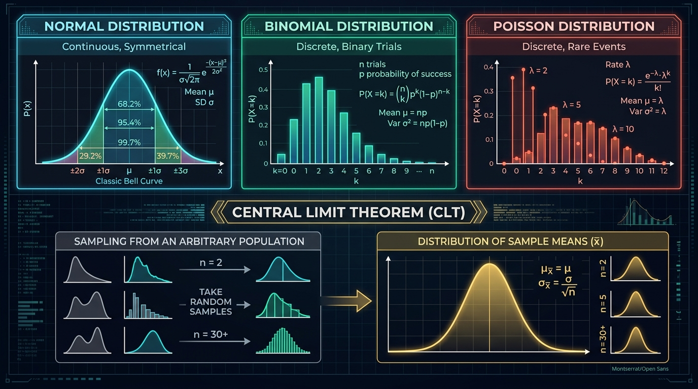
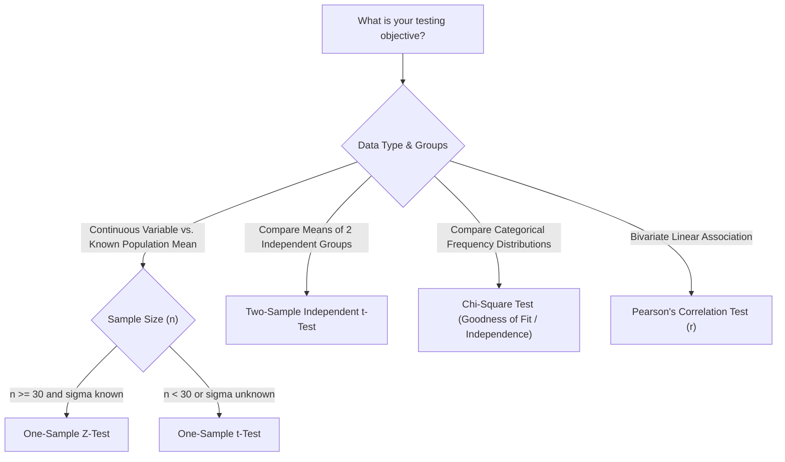
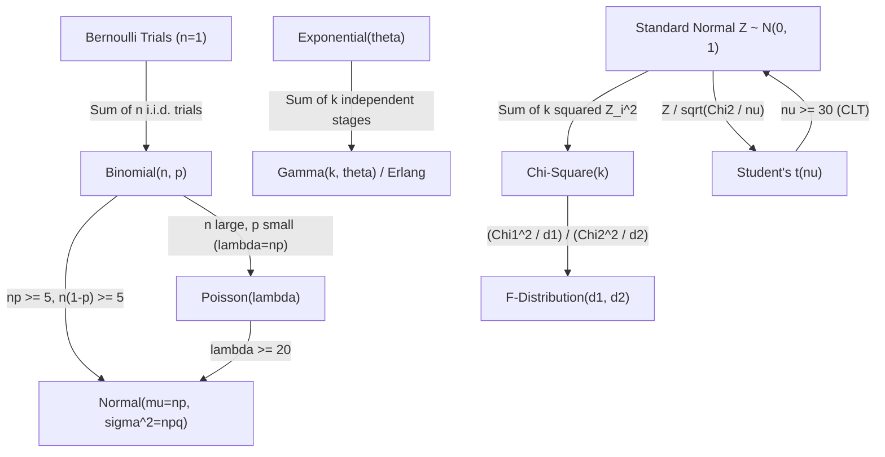

# Module 2: Statistical Methods & Probability Foundations
> **Sessions Covered:** Sessions 5, 6, 7, 8, 9, 10, 11, 12  
> **Total Time:** 16T + 16L + 8SL = 40 Hours  
> **Target Course:** Data Analytics (PGCP-AI, C-DAC ACTS)

---

## 📌 High-Yield "Nano" Takeaways (Exam Rapid-Recall)
- **Central Tendency Robustness:** For symmetric distributions, $\text{Mean} \approx \text{Median} \approx \text{Mode}$. For right-skewed distributions, $\text{Mean} > \text{Median} > \text{Mode}$.
- **Dispersion Metrics:**
  - $\text{Variance } (\sigma^2) = \frac{\sum (x_i - \mu)^2}{N}$
  - $\text{Standard Deviation } (\sigma) = \sqrt{\sigma^2}$ (same units as original data)
  - $\text{Coefficient of Variation } (CV) = \frac{\sigma}{\mu} \times 100\%$ (unitless, compares volatility across different scales).
- **Outlier Rule (Tukey's IQR Fence):**
  $$\text{Lower Bound} = Q_1 - 1.5 \times \text{IQR}, \quad \text{Upper Bound} = Q_3 + 1.5 \times \text{IQR}$$
  Values outside these boundaries are potential outliers.
- **Central Limit Theorem (CLT):** Given any population with mean $\mu$ and standard deviation $\sigma$ (regardless of shape), the distribution of sample means $\bar{X}$ approaches a Normal distribution $\mathcal{N}\left(\mu, \frac{\sigma}{\sqrt{n}}\right)$ as sample size $n \ge 30$.
- **Hypothesis Testing Decision Rule:**
  - If $p\text{-value} \le \alpha$ (typically $0.05$): **Reject $H_0$** (Statistically significant finding).
  - If $p\text{-value} > \alpha$: **Fail to reject $H_0$** (Insufficient evidence).
  - *Type I Error ($\alpha$):* False Positive (convicting an innocent person).
  - *Type II Error ($\beta$):* False Negative (letting a guilty person walk free).

---

## 🖼️ Architectural Diagram: Probability Distributions & CLT




```mermaid
flowchart TD
    A["What is your testing objective?"] --> B{"Data Type & Groups"}
    B -->|"Continuous Variable vs. Known Population Mean"| C{"Sample Size (n)"}
    C -->|"n >= 30 and sigma known"| D["One-Sample Z-Test"]
    C -->|"n < 30 or sigma unknown"| E["One-Sample t-Test"]
    B -->|"Compare Means of 2 Independent Groups"| F["Two-Sample Independent t-Test"]
    B -->|"Compare Categorical Frequency Distributions"| G["Chi-Square Test (Goodness of Fit / Independence)"]
    B -->|"Bivariate Linear Association"| H["Pearson's Correlation Test (r)"]
```

---

## 📖 Deep-Dive Theory & Conceptual Walkthrough

### Session 5: Descriptive Statistics (Location & Dispersion)
*(Hours: 2 Theory + 2 Lab + 2 Self-Learning)*

#### 1. Measures of Location (Central Tendency)
- **Mean:** The arithmetic average. Highly susceptible to extreme values.
- **Median:** The middle value of sorted data (50th percentile). Resistant to outliers.
- **Mode:** The most frequently occurring observation. Useful for categorical data.

#### 2. Measures of Dispersion (Spread)
- **Range:** $\text{Max} - \text{Min}$. Primitive, captures only extrema.
- **Interquartile Range (IQR):** $Q_3 - Q_1$ (middle 50% of the distribution). Unaffected by extreme tails.
- **Standard Deviation & Variance:** Measures how tightly or loosely values cluster around the mean.
- **Coefficient of Variation (CV):**
  $$\text{CV} = \left(\frac{s}{\bar{x}}\right) \times 100\%$$
  *Example:* A stock with price \$100 and standard deviation \$10 ($CV = 10\%$) is far more stable than a penny stock at \$1 with standard deviation \$0.50 ($CV = 50\%$).

---

### Sessions 6 & 7: Sampling & Probability Foundations
*(Hours: 4 Theory + 4 Lab + 2 Self-Learning)*

#### 1. Sample vs. Population
- **Population ($N$):** The complete collection of all elements under study (e.g., all 1.4 billion citizens). Parameters are denoted by Greek letters ($\mu, \sigma$).
- **Sample ($n$):** A representative subset drawn from the population. Statistics are denoted by Latin letters ($\bar{x}, s$).
- **Sampling Methods:**
  - *Simple Random Sampling (SRS):* Every individual has an equal probability of selection.
  - *Stratified Sampling:* Divide population into homogeneous subgroups (strata, e.g., age brackets) and sample proportionally from each.
  - *Cluster Sampling:* Divide population into heterogeneous geographic clusters, randomly pick entire clusters.
  - *Re-sampling (Bootstrapping):* Drawing repeated samples with replacement from the existing sample to estimate confidence intervals.

#### 2. Probability Rules & Bayes' Theorem
- **Marginal Probability:** $P(A)$ — Probability of event $A$ occurring independently.
- **Joint Probability:** $P(A \cap B) = P(A) \times P(B|A)$ — Probability of both $A$ and $B$ occurring.
- **Conditional Probability:** $P(A|B) = \frac{P(A \cap B)}{P(B)}$ — Probability of $A$ given that event $B$ has already occurred.
- **Bayes' Theorem Formula:**
  $$P(A|B) = \frac{P(B|A) \cdot P(A)}{P(B)}$$
  Where:
  - $P(A)$ is the **Prior Probability** (initial belief before evidence).
  - $P(B|A)$ is the **Likelihood** of observing evidence $B$ if hypothesis $A$ is true.
  - $P(B)$ is the **Marginal Evidence** ($P(B|A)P(A) + P(B|\neg A)P(\neg A)$).
  - $P(A|B)$ is the **Posterior Probability** (updated belief after evidence).

*Medical Diagnosis Example:*
A rare disease affects $1\%$ of the population ($P(D) = 0.01$). A test is $95\%$ accurate ($P(+|D) = 0.95$) with a $5\%$ false-positive rate ($P(+|\neg D) = 0.05$). If a patient tests positive:
$$P(D|+) = \frac{0.95 \times 0.01}{(0.95 \times 0.01) + (0.05 \times 0.99)} = \frac{0.0095}{0.0095 + 0.0495} \approx 16.1\%$$
Even with a $95\%$ accurate test, the probability of truly having the disease is only $\approx 16\%$ because the base rate is so low!

---

### Session 8: Random Variables, Distributions & The CLT
*(Hours: 2 Theory + 2 Lab + 2 Self-Learning)*

#### 1. Discrete vs. Continuous Random Variables
- **Discrete:** Takes countable separate values (e.g., number of defective items, coin tosses).
- **Continuous:** Takes any value within an uninterrupted continuous range (e.g., customer height, transaction amount).

#### 2. Comprehensive Probability Distributions (Discrete & Continuous)

Probability distributions model how probabilities are assigned across the possible numerical outcomes of a random variable $X$.

---

### A. Continuous Probability Distributions (Probability Density Functions - PDF)

For continuous random variables, the probability of obtaining any exact single value is zero ($P(X = c) = 0$). Probabilities are calculated over intervals via the integral of the Probability Density Function (PDF):
$$P(a \le X \le b) = \int_{a}^{b} f(x) \, dx, \quad \text{where } \int_{-\infty}^{\infty} f(x) \, dx = 1 \text{ and } f(x) \ge 0$$

#### 1. Normal (Gaussian) Distribution: $\mathcal{N}(\mu, \sigma^2)$
* **Concept:** Symmetrical bell-shaped curve that emerges naturally when independent random variables are aggregated (Central Limit Theorem).
* **Parameters:** Mean $\mu \in \mathbb{R}$ (location), Standard Deviation $\sigma > 0$ (scale).
* **Support:** $x \in (-\infty, \infty)$
* **Probability Density Function (PDF):**
  $$f(x) = \frac{1}{\sigma \sqrt{2\pi}} \exp\left( -\frac{1}{2}\left(\frac{x - \mu}{\sigma}\right)^2 \right)$$
* **Mean & Variance:**
  $$E[X] = \mu, \quad \text{Var}(X) = \sigma^2, \quad \text{Std Dev } \sigma(X) = \sigma$$
* **Standard Normal Transformation ($Z$-Score):**
  $$Z = \frac{X - \mu}{\sigma} \sim \mathcal{N}(0, 1), \quad \phi(z) = \frac{1}{\sqrt{2\pi}} e^{-z^2/2}$$
* **Empirical Rule (68–95–99.7%):**
  * $P(\mu - 1\sigma \le X \le \mu + 1\sigma) \approx 68.27\%$
  * $P(\mu - 2\sigma \le X \le \mu + 2\sigma) \approx 95.45\%$
  * $P(\mu - 3\sigma \le X \le \mu + 3\sigma) \approx 99.73\%$
* **NumPy / SciPy:** `rng.normal(loc=mu, scale=sigma, size=N)` | `scipy.stats.norm(loc=mu, scale=sigma)`
* **Applications:** Residual modeling in OLS regression, sensor noise, ML weight initialization, heights, exam scores.

---

#### 2. Continuous Uniform Distribution: $\mathcal{U}(a, b)$
* **Concept:** Flat distribution where every real number within a closed interval $[a, b]$ has identical likelihood. Maximum entropy distribution when only bounds are known.
* **Parameters:** Lower bound $a$, Upper bound $b$ ($-\infty < a < b < \infty$).
* **Support:** $x \in [a, b]$
* **Probability Density Function (PDF):**
  $$f(x) = \begin{cases} \frac{1}{b - a}, & a \le x \le b \\ 0, & \text{otherwise} \end{cases}$$
* **Cumulative Distribution Function (CDF):**
  $$F(x) = \begin{cases} 0, & x < a \\ \frac{x - a}{b - a}, & a \le x \le b \\ 1, & x > b \end{cases}$$
* **Mean & Variance:**
  $$E[X] = \frac{a + b}{2}, \quad \text{Var}(X) = \frac{(b - a)^2}{12}$$
* **NumPy / SciPy:** `rng.uniform(low=a, high=b, size=N)` | `scipy.stats.uniform(loc=a, scale=b-a)`
* **Applications:** Random rotation data augmentation in Computer Vision (e.g., $[-15^\circ, +15^\circ]$), Monte Carlo baseline priors, quantization roundoff error.

---

#### 3. Exponential Distribution: $\text{Exp}(\lambda)$ or $\text{Exp}(\theta)$
* **Concept:** Models the waiting time between independent Poisson point events occurring continuously at a constant average rate $\lambda$.
* **Parameters:** Rate parameter $\lambda > 0$ (events/time unit) OR Scale parameter $\theta = \frac{1}{\lambda} > 0$ (average wait time).
* **Support:** $x \in [0, \infty)$
* **Probability Density Function (PDF):**
  $$f(x) = \lambda e^{-\lambda x} = \frac{1}{\theta} e^{-x / \theta}, \quad x \ge 0$$
* **Cumulative Distribution Function (CDF) & Survival Function:**
  $$F(x) = 1 - e^{-\lambda x} = 1 - e^{-x/\theta}, \quad S(x) = P(X > x) = e^{-\lambda x}$$
* **Mean & Variance:**
  $$E[X] = \frac{1}{\lambda} = \theta, \quad \text{Var}(X) = \frac{1}{\lambda^2} = \theta^2, \quad \sigma = \theta$$
* **Fundamental Memoryless Property:**
  $$P(X > s + t \mid X > s) = P(X > t), \quad \forall s, t \ge 0$$
  *(Past waiting time confers zero information regarding remaining time until arrival).*
* **NumPy / SciPy:** `rng.exponential(scale=theta, size=N)` | `scipy.stats.expon(scale=1/lam)`
* **Applications:** Service duration at ATM/barista, component lifetime, interval between radioactive decays, packet inter-arrival times.

---

#### 4. Gamma Distribution: $\text{Gamma}(k, \theta)$ or $\text{Gamma}(\alpha, \beta)$
* **Concept:** Generalization of the Exponential distribution. Models the waiting time required until $k$ independent Poisson events occur (when $k$ is an integer, termed the **Erlang Distribution**).
* **Parameters:** Shape parameter $k > 0$ (or $\alpha$), Scale parameter $\theta > 0$ (or rate $\beta = 1/\theta$).
* **Support:** $x \in (0, \infty)$
* **Probability Density Function (PDF):**
  $$f(x) = \frac{1}{\Gamma(k) \theta^k} x^{k-1} e^{-x / \theta}, \quad x > 0$$
  where the Gamma function is $\Gamma(k) = \int_0^\infty u^{k-1} e^{-u} \, du$, with $\Gamma(n) = (n-1)!$ for integer $n$.
* **Mean, Variance & Mode:**
  $$E[X] = k\theta = \frac{\alpha}{\beta}, \quad \text{Var}(X) = k\theta^2 = \frac{\alpha}{\beta^2}, \quad \text{Mode} = (k - 1)\theta \quad (k \ge 1)$$
* **Key Convolution Property:**
  If $X_1, X_2, \dots, X_k \stackrel{i.i.d.}{\sim} \text{Exp}(\theta)$, then $\sum_{i=1}^k X_i \sim \text{Gamma}(k, \theta)$ (Erlang-$k$).
* **NumPy / SciPy:** `rng.gamma(shape=k, scale=theta, size=N)` | `scipy.stats.gamma(a=k, scale=theta)`
* **Applications:** Multi-stage queue waiting times, daily cumulative precipitation/rainfall modeling, aggregate insurance loss claims (Solvency II reserves).

---

#### 5. Beta Distribution: $\text{Beta}(\alpha, \beta)$
* **Concept:** Continuous family of distributions bounded strictly to the interval $[0, 1]$. Highly versatile shape that models percentages, probabilities, and conversion rates. Serves as the conjugate prior for Binomial likelihoods in Bayesian inference.
* **Parameters:** Shape parameters $\alpha > 0$ (prior pseudo-successes) and $\beta > 0$ (prior pseudo-failures).
* **Support:** $x \in [0, 1]$
* **Probability Density Function (PDF):**
  $$f(x) = \frac{x^{\alpha - 1}(1 - x)^{\beta - 1}}{B(\alpha, \beta)}, \quad 0 \le x \le 1$$
  where $B(\alpha, \beta) = \frac{\Gamma(\alpha)\Gamma(\beta)}{\Gamma(\alpha + \beta)} = \int_0^1 u^{\alpha - 1}(1 - u)^{\beta - 1} \, du$.
* **Mean, Variance & Mode:**
  $$E[X] = \frac{\alpha}{\alpha + \beta}, \quad \text{Var}(X) = \frac{\alpha \beta}{(\alpha + \beta)^2 (\alpha + \beta + 1)}, \quad \text{Mode} = \frac{\alpha - 1}{\alpha + \beta - 2} \quad (\alpha, \beta > 1)$$
* **Shape Flexibility:**
  * $\alpha = 1, \beta = 1$: Standard Uniform $\mathcal{U}(0, 1)$
  * $\alpha = \beta > 1$: Symmetric bell-shape centered at $0.5$
  * $\alpha < 1, \beta < 1$: U-shaped (bimodal density at 0 and 1)
  * $\alpha > \beta$: Left-skewed (concentrated near 1)
  * $\alpha < \beta$: Right-skewed (concentrated near 0)
* **NumPy / SciPy:** `rng.beta(a=alpha, b=beta, size=N)` | `scipy.stats.beta(a=alpha, b=beta)`
* **Applications:** A/B testing conversion rates, customer churn probabilities, Bayesian spam classifier priors, Project Management PERT task duration estimates.

---

#### 6. Student's t-Distribution: $t(\nu)$
* **Concept:** Bell-shaped symmetric distribution with heavier tails than the standard normal distribution. Used for hypothesis testing when the population standard deviation $\sigma$ is unknown and estimated from small samples ($n < 30$).
* **Parameter:** Degrees of freedom $\nu = n - 1 > 0$.
* **Support:** $t \in (-\infty, \infty)$
* **Definition:** $T = \frac{Z}{\sqrt{V / \nu}}$, where $Z \sim \mathcal{N}(0, 1)$ and $V \sim \chi^2(\nu)$ are independent.
* **Probability Density Function (PDF):**
  $$f(t) = \frac{\Gamma\left(\frac{\nu + 1}{2}\right)}{\sqrt{\pi \nu} \, \Gamma\left(\frac{\nu}{2}\right)} \left(1 + \frac{t^2}{\nu}\right)^{-\frac{\nu + 1}{2}}$$
* **Mean & Variance:**
  $$E[T] = 0 \quad (\nu > 1), \quad \text{Var}(T) = \frac{\nu}{\nu - 2} \quad (\nu > 2)$$
* **Asymptotic Convergence:** As $\nu \to \infty$ (practically $\nu \ge 30$), $t(\nu) \to \mathcal{N}(0, 1)$.
* **NumPy / SciPy:** `rng.standard_t(df=nu, size=N)` | `scipy.stats.t(df=nu)`
* **Applications:** One-sample/two-sample independent $t$-tests, confidence intervals for small samples, robust financial asset return modeling.

---

#### 7. Chi-Square Distribution: $\chi^2(k)$
* **Concept:** Formed by the sum of $k$ independent, squared standard normal random variables: $\chi^2 = \sum_{i=1}^k Z_i^2$ where $Z_i \sim \mathcal{N}(0, 1)$.
* **Parameter:** Degrees of freedom $k \in \mathbb{Z}^+$. (Special case of Gamma: $\text{Gamma}(k/2, \theta=2)$).
* **Support:** $x \in [0, \infty)$
* **Probability Density Function (PDF):**
  $$f(x) = \frac{1}{2^{k/2} \Gamma(k/2)} x^{k/2 - 1} e^{-x / 2}, \quad x > 0$$
* **Mean & Variance:**
  $$E[X] = k, \quad \text{Var}(X) = 2k, \quad \sigma = \sqrt{2k}$$
* **NumPy / SciPy:** `rng.chisquare(df=k, size=N)` | `scipy.stats.chi2(df=k)`
* **Applications:** Goodness-of-Fit tests, contingency table tests of independence, sample variance confidence intervals ($s^2 (n-1)/\sigma^2 \sim \chi^2(n-1)$).

---

#### 8. F-Distribution (Fisher-Snedecor): $F(d_1, d_2)$
* **Concept:** Ratio of two independent chi-square variables, each divided by its respective degrees of freedom: $F = \frac{\chi_1^2 / d_1}{\chi_2^2 / d_2}$.
* **Parameters:** Numerator degrees of freedom $d_1$, Denominator degrees of freedom $d_2$.
* **Support:** $x \in [0, \infty)$
* **Mean & Variance:**
  $$E[X] = \frac{d_2}{d_2 - 2} \quad (d_2 > 2), \quad \text{Var}(X) = \frac{2 d_2^2 (d_1 + d_2 - 2)}{d_1 (d_2 - 2)^2 (d_2 - 4)} \quad (d_2 > 4)$$
* **NumPy / SciPy:** `rng.f(dfnum=d1, dfden=d2, size=N)` | `scipy.stats.f(dfn=d1, dfd=d2)`
* **Applications:** Analysis of Variance (ANOVA) multi-group mean comparisons, regression overall model significance test ($F = \frac{MS_{\text{model}}}{MS_{\text{residual}}}$), equality of two population variances.

---

#### 9. Log-Normal Distribution: $\text{Lognormal}(\mu, \sigma)$
* **Concept:** Distribution of a continuous random variable whose natural logarithm is normally distributed: $\ln(X) \sim \mathcal{N}(\mu, \sigma^2)$. Strictly positive with a heavy right tail.
* **Parameters:** Location $\mu \in \mathbb{R}$ and Scale $\sigma > 0$ (mean and std dev of $\ln X$).
* **Support:** $x \in (0, \infty)$
* **Probability Density Function (PDF):**
  $$f(x) = \frac{1}{x \sigma \sqrt{2\pi}} \exp\left( -\frac{(\ln x - \mu)^2}{2\sigma^2} \right), \quad x > 0$$
* **Mean, Variance & Mode:**
  $$E[X] = e^{\mu + \sigma^2 / 2}, \quad \text{Var}(X) = (e^{\sigma^2} - 1) e^{2\mu + \sigma^2}, \quad \text{Mode} = e^{\mu - \sigma^2}$$
* **NumPy / SciPy:** `rng.lognormal(mean=mu, sigma=sigma, size=N)` | `scipy.stats.lognorm(s=sigma, scale=np.exp(mu))`
* **Applications:** Household wealth/income distribution, real estate valuations, stock prices in Black-Scholes option pricing, internet download sizes.

---

#### 10. Weibull Distribution: $\text{Weibull}(k, \lambda)$
* **Concept:** Flexible distribution widely utilized in reliability engineering to model failure rates and component lifespans over time.
* **Parameters:** Shape parameter $k > 0$, Scale parameter $\lambda > 0$.
* **Support:** $x \in [0, \infty)$
* **Probability Density Function (PDF) & CDF:**
  $$f(x) = \frac{k}{\lambda} \left(\frac{x}{\lambda}\right)^{k-1} e^{-(x/\lambda)^k}, \quad F(x) = 1 - e^{-(x/\lambda)^k}, \quad x \ge 0$$
* **Hazard Rate Interpretations:**
  * $k < 1$: Decreasing failure rate ("infant mortality" / early break-in defects).
  * $k = 1$: Constant failure rate (identical to Exponential distribution $\text{Exp}(\lambda)$).
  * $k > 1$: Increasing failure rate (aging, wear-out, and mechanical fatigue).
* **NumPy / SciPy:** `rng.weibull(a=k, size=N) * scale` | `scipy.stats.weibull_min(c=k, scale=lam)`
* **Applications:** Industrial machine failure times, wind turbine power generation speeds, medical survival analysis.

---

#### 11. Pareto Distribution (Power-Law / 80-20 Rule): $\text{Pareto}(x_m, \alpha)$
* **Concept:** Heavy-tailed distribution where a small percentage of causes account for the majority of the effect (e.g., 80% of wealth held by 20% of population).
* **Parameters:** Minimum possible value (scale) $x_m > 0$, Shape parameter $\alpha > 0$.
* **Support:** $x \in [x_m, \infty)$
* **Probability Density Function (PDF) & CDF:**
  $$f(x) = \frac{\alpha x_m^\alpha}{x^{\alpha + 1}}, \quad F(x) = 1 - \left(\frac{x_m}{x}\right)^\alpha, \quad x \ge x_m$$
* **Mean & Variance:**
  $$E[X] = \frac{\alpha x_m}{\alpha - 1} \quad (\alpha > 1), \quad \text{Var}(X) = \frac{\alpha x_m^2}{(\alpha - 1)^2 (\alpha - 2)} \quad (\alpha > 2)$$
* **NumPy / SciPy:** `(rng.pareto(a=alpha, size=N) + 1) * xm` | `scipy.stats.pareto(b=alpha, scale=xm)`
* **Applications:** 80/20 customer revenue segmentation, word frequency in natural language (Zipf's Law), severity of cyber security attacks.

---

### B. Discrete Probability Distributions (Probability Mass Functions - PMF)

For discrete random variables, the Probability Mass Function (PMF) gives the exact probability of $X$ taking a specific integer value:
$$P(X = k) = p_k, \quad \text{where } \sum_{k} P(X = k) = 1 \text{ and } 0 \le P(X = k) \le 1$$

#### 1. Bernoulli Distribution: $\text{Bernoulli}(p)$
* **Concept:** Single trial resulting in one of two mutually exclusive outcomes: Success ($X = 1$) with probability $p$, or Failure ($X = 0$) with probability $q = 1 - p$.
* **Support:** $k \in \{0, 1\}$
* **Probability Mass Function (PMF):**
  $$P(X = k) = p^k (1 - p)^{1 - k}, \quad k \in \{0, 1\}$$
* **Mean & Variance:**
  $$E[X] = p, \quad \text{Var}(X) = p(1 - p) = pq, \quad \sigma = \sqrt{pq}$$
* **NumPy / SciPy:** `rng.binomial(n=1, p=p, size=N)` | `scipy.stats.bernoulli(p=p)`
* **Applications:** Single coin toss, customer churn (yes/no), loan default binary outcome.

---

#### 2. Binomial Distribution: $\text{Binomial}(n, p)$
* **Concept:** Total number of successes $k$ observed across $n$ independent and identically distributed Bernoulli trials with constant success probability $p$.
* **Parameters:** Number of trials $n \in \mathbb{Z}^+$, Success probability $p \in [0, 1]$.
* **Support:** $k \in \{0, 1, 2, \dots, n\}$
* **Probability Mass Function (PMF):**
  $$P(X = k) = \binom{n}{k} p^k (1 - p)^{n - k} = \frac{n!}{k!(n - k)!} p^k (1 - p)^{n - k}$$
* **Mean & Variance:**
  $$E[X] = np, \quad \text{Var}(X) = np(1 - p) = npq, \quad \sigma = \sqrt{npq}$$
* **Asymptotic Approximations:**
  * **To Normal:** When $np \ge 5$ and $n(1-p) \ge 5$, $X \stackrel{\text{approx}}{\sim} \mathcal{N}(\mu = np, \sigma^2 = npq)$ with continuity correction $\pm 0.5$.
  * **To Poisson:** When $n$ is very large ($n \ge 100$) and $p$ is very small ($p \le 0.05$), $X \stackrel{\text{approx}}{\sim} \text{Poisson}(\lambda = np)$.
* **NumPy / SciPy:** `rng.binomial(n=n, p=p, size=N)` | `scipy.stats.binom(n=n, p=p)`
* **Applications:** Number of defective items in a batch of $n$ units, clicks from $n$ ad impressions, clinical trial recovery counts.

---

#### 3. Poisson Distribution: $\text{Poisson}(\lambda)$
* **Concept:** Models the count of rare, independent events occurring within a fixed, specified interval of time, area, or volume at a constant average rate $\lambda$.
* **Parameter:** Average arrival rate per interval $\lambda > 0$.
* **Support:** $k \in \{0, 1, 2, 3, \dots\}$ (countably infinite)
* **Probability Mass Function (PMF):**
  $$P(X = k) = \frac{\lambda^k e^{-\lambda}}{k!}, \quad k \ge 0$$
* **Mean & Variance (Equidispersion Property):**
  $$E[X] = \lambda, \quad \text{Var}(X) = \lambda, \quad \sigma = \sqrt{\lambda}$$
  *(Exam Rule: If $\text{Mean} \approx \text{Variance}$, Poisson is the ideal candidate model).*
* **NumPy / SciPy:** `rng.poisson(lam=lam, size=N)` | `scipy.stats.poisson(mu=lam)`
* **Applications:** Website server hits per minute, customer calls arriving at a support desk per hour, number of typing typos per book page.

---

#### 4. Geometric Distribution: $\text{Geometric}(p)$
* **Concept:** Number of Bernoulli trials required to achieve the **first** success.
* **Parameter:** Success probability $p \in (0, 1]$.
* **Support:** $k \in \{1, 2, 3, \dots\}$
* **Probability Mass Function (PMF):**
  $$P(X = k) = (1 - p)^{k - 1} p, \quad k \ge 1$$
* **Mean & Variance:**
  $$E[X] = \frac{1}{p}, \quad \text{Var}(X) = \frac{1 - p}{p^2}$$
* **Discrete Memoryless Property:** $P(X > s + t \mid X > s) = P(X > t)$.
* **NumPy / SciPy:** `rng.geometric(p=p, size=N)` | `scipy.stats.geom(p=p)`
* **Applications:** Cold sales calls required before closing first deal, number of lottery tickets bought until first win.

---

#### 5. Negative Binomial Distribution: $\text{NB}(r, p)$
* **Concept:** Generalization of Geometric distribution. Total number of failures $k$ encountered before observing exactly $r$ successes in repeated Bernoulli trials.
* **Parameters:** Target successes $r \in \mathbb{Z}^+$, Success probability $p \in (0, 1]$.
* **Support:** $k \in \{0, 1, 2, \dots\}$ failures
* **Probability Mass Function (PMF):**
  $$P(X = k) = \binom{k + r - 1}{k} p^r (1 - p)^k = \binom{k + r - 1}{r - 1} p^r (1 - p)^k$$
* **Mean & Variance:**
  $$E[X] = \frac{r(1 - p)}{p}, \quad \text{Var}(X) = \frac{r(1 - p)}{p^2}$$
* **Overdispersion Modeling:** Because $\text{Var}(X) > E[X]$, Negative Binomial is used as an alternative to Poisson for overdispersed count data.
* **NumPy / SciPy:** `rng.negative_binomial(n=r, p=p, size=N)` | `scipy.stats.nbinom(n=r, p=p)`
* **Applications:** Overdispersed customer visit counts, genetic read counts in bioinformatics.

---

#### 6. Hypergeometric Distribution: $\text{Hypergeometric}(N, K, n)$
* **Concept:** Number of successes $k$ in a sample drawn **without replacement** from a finite population containing two distinct classes. (Trials are dependent, unlike Binomial).
* **Parameters:** Population size $N$, Total success items in population $K$, Sample size drawn $n$.
* **Support:** $k \in \{\max(0, n - (N - K)), \dots, \min(n, K)\}$
* **Probability Mass Function (PMF):**
  $$P(X = k) = \frac{\binom{K}{k} \binom{N - K}{n - k}}{\binom{N}{n}}$$
* **Mean & Variance:**
  $$E[X] = n \frac{K}{N}, \quad \text{Var}(X) = n \left(\frac{K}{N}\right) \left(1 - \frac{K}{N}\right) \left(\frac{N - n}{N - 1}\right)$$
  where $\frac{N - n}{N - 1}$ is the **Finite Population Correction (FPC)** factor.
* **NumPy / SciPy:** `rng.hypergeometric(ngood=K, nbad=N-K, nsample=n, size=N)` | `scipy.stats.hypergeom(M=N, n=K, N=n)`
* **Applications:** Quality assurance lot sampling without replacement, lottery ball draws, card deck hands (e.g., number of Aces drawn in 5 cards).

---

#### 7. Discrete Uniform Distribution: $\mathcal{U}\{a, b\}$
* **Concept:** $n = b - a + 1$ consecutive integers have equal probability of selection.
* **Support:** $k \in \{a, a + 1, \dots, b\}$
* **Probability Mass Function (PMF):**
  $$P(X = k) = \frac{1}{n} = \frac{1}{b - a + 1}$$
* **Mean & Variance:**
  $$E[X] = \frac{a + b}{2}, \quad \text{Var}(X) = \frac{(b - a + 1)^2 - 1}{12} = \frac{n^2 - 1}{12}$$
* **NumPy / SciPy:** `rng.integers(low=a, high=b+1, size=N)` | `scipy.stats.randint(low=a, high=b+1)`
* **Applications:** Rolling a fair 6-sided die ($a=1, b=6 \implies E[X] = 3.5, \text{Var} \approx 2.92$), random ticket draw IDs.

---

### C. Master Probability Distribution Formula & Selection Matrix

| Distribution | Type | Parameters | Support | PDF / PMF Formula | Mean $E[X]$ | Variance $\text{Var}(X)$ | Python (`scipy.stats`) | Primary Use Case |
| :--- | :---: | :---: | :---: | :---: | :---: | :---: | :---: | :--- |
| **Normal** | Cont. | $\mu \in \mathbb{R}, \sigma > 0$ | $(-\infty, \infty)$ | $\frac{1}{\sigma\sqrt{2\pi}} e^{-\frac{(x-\mu)^2}{2\sigma^2}}$ | $\mu$ | $\sigma^2$ | `norm(loc=mu, scale=sigma)` | Regression errors, sensor noise, CLT |
| **Uniform** | Cont. | $a < b$ | $[a, b]$ | $\frac{1}{b - a}$ | $\frac{a + b}{2}$ | $\frac{(b - a)^2}{12}$ | `uniform(loc=a, scale=b-a)` | CV data augmentation, baseline priors |
| **Exponential** | Cont. | $\theta > 0$ ($\lambda = \frac{1}{\theta}$) | $[0, \infty)$ | $\frac{1}{\theta} e^{-x/\theta}$ | $\theta = \frac{1}{\lambda}$ | $\theta^2 = \frac{1}{\lambda^2}$ | `expon(scale=theta)` | Inter-arrival times, service wait, failure |
| **Gamma** | Cont. | $k > 0, \theta > 0$ | $(0, \infty)$ | $\frac{1}{\Gamma(k)\theta^k} x^{k-1} e^{-x/\theta}$ | $k\theta$ | $k\theta^2$ | `gamma(a=k, scale=theta)` | Sum of $k$ wait times, rainfall, risk VaR |
| **Beta** | Cont. | $\alpha > 0, \beta > 0$ | $[0, 1]$ | $\frac{x^{\alpha-1}(1-x)^{\beta-1}}{B(\alpha, \beta)}$ | $\frac{\alpha}{\alpha+\beta}$ | $\frac{\alpha\beta}{(\alpha+\beta)^2(\alpha+\beta+1)}$ | `beta(a=alpha, b=beta)` | Probabilities, A/B conversion rates |
| **Student's t** | Cont. | $\nu > 0$ | $(-\infty, \infty)$ | $\propto \left(1 + \frac{t^2}{\nu}\right)^{-\frac{\nu+1}{2}}$ | $0$ ($\nu>1$) | $\frac{\nu}{\nu - 2}$ ($\nu>2$) | `t(df=nu)` | Hypothesis tests ($n < 30$, $\sigma$ unknown) |
| **Chi-Square** | Cont. | $k \in \mathbb{Z}^+$ | $[0, \infty)$ | $\frac{1}{2^{k/2}\Gamma(k/2)} x^{\frac{k}{2}-1} e^{-\frac{x}{2}}$ | $k$ | $2k$ | `chi2(df=k)` | Goodness-of-Fit, contingency tables |
| **F-Dist.** | Cont. | $d_1, d_2 \in \mathbb{Z}^+$ | $[0, \infty)$ | Ratio of 2 $\chi^2/df$ | $\frac{d_2}{d_2 - 2}$ | $\frac{2d_2^2(d_1+d_2-2)}{d_1(d_2-2)^2(d_2-4)}$ | `f(dfn=d1, dfd=d2)` | ANOVA test, overall model $R^2$ test |
| **Log-Normal** | Cont. | $\mu, \sigma > 0$ | $(0, \infty)$ | $\frac{1}{x\sigma\sqrt{2\pi}} e^{-\frac{(\ln x - \mu)^2}{2\sigma^2}}$ | $e^{\mu + \sigma^2/2}$ | $(e^{\sigma^2}-1)e^{2\mu+\sigma^2}$ | `lognorm(s=sigma, scale=e^mu)` | Incomes, stock prices, real estate |
| **Weibull** | Cont. | $k > 0, \lambda > 0$ | $[0, \infty)$ | $\frac{k}{\lambda}\left(\frac{x}{\lambda}\right)^{k-1} e^{-(x/\lambda)^k}$ | $\lambda \Gamma(1 + 1/k)$ | $\lambda^2[\Gamma(1+2/k)-\Gamma^2]$ | `weibull_min(c=k, scale=lam)`| Industrial reliability, machine wear-out |
| **Pareto** | Cont. | $x_m > 0, \alpha > 0$ | $[x_m, \infty)$ | $\frac{\alpha x_m^\alpha}{x^{\alpha+1}}$ | $\frac{\alpha x_m}{\alpha - 1}$ ($\alpha>1$) | $\frac{\alpha x_m^2}{(\alpha-1)^2(\alpha-2)}$ | `pareto(b=alpha, scale=xm)` | 80/20 power law, wealth distribution |
| **Bernoulli** | Disc. | $p \in [0, 1]$ | $\{0, 1\}$ | $p^k(1-p)^{1-k}$ | $p$ | $p(1 - p)$ | `bernoulli(p=p)` | Single binary trial (Success/Fail) |
| **Binomial** | Disc. | $n \in \mathbb{Z}^+, p$ | $\{0, \dots, n\}$ | $\binom{n}{k} p^k (1-p)^{n-k}$ | $np$ | $np(1 - p)$ | `binom(n=n, p=p)` | Success count in $n$ independent trials |
| **Poisson** | Disc. | $\lambda > 0$ | $\{0, 1, 2, \dots\}$ | $\frac{\lambda^k e^{-\lambda}}{k!}$ | $\lambda$ | $\lambda$ | `poisson(mu=lam)` | Event arrival counts in fixed interval |
| **Geometric** | Disc. | $p \in (0, 1]$ | $\{1, 2, \dots\}$ | $(1-p)^{k-1} p$ | $\frac{1}{p}$ | $\frac{1-p}{p^2}$ | `geom(p=p)` | Trials needed until 1st success |
| **Neg. Binom**| Disc. | $r \in \mathbb{Z}^+, p$ | $\{0, 1, 2, \dots\}$ | $\binom{k+r-1}{k} p^r(1-p)^k$ | $\frac{r(1-p)}{p}$ | $\frac{r(1-p)}{p^2}$ | `nbinom(n=r, p=p)` | Failures before $r$-th success, overdispersion |
| **Hypergeom** | Disc. | $N, K, n$ | Max/Min bounds | $\frac{\binom{K}{k}\binom{N-K}{n-k}}{\binom{N}{n}}$ | $n\frac{K}{N}$ | $n\frac{K}{N}(1-\frac{K}{N})\frac{N-n}{N-1}$ | `hypergeom(M=N, n=K, N=n)` | Sampling without replacement |
| **Disc. Unif**| Disc. | $a \le b$ integers | $\{a, \dots, b\}$ | $\frac{1}{b - a + 1}$ | $\frac{a + b}{2}$ | $\frac{(b - a + 1)^2 - 1}{12}$ | `randint(low=a, high=b+1)` | Rolling fair die, random selection |

---

### D. Central Limit Theorem (CLT) & Distribution Interconnections


```mermaid
graph TD
    A["Bernoulli Trials (n=1)"] -->|"Sum of n i.i.d. trials"| B["Binomial(n, p)"]
    B -->|"np >= 5, n(1-p) >= 5"| C["Normal(mu=np, sigma^2=npq)"]
    B -->|"n large, p small (lambda=np)"| D["Poisson(lambda)"]
    D -->|"lambda >= 20"| C
    E["Exponential(theta)"] -->|"Sum of k independent stages"| F["Gamma(k, theta) / Erlang"]
    G["Standard Normal Z ~ N(0, 1)"] -->|"Sum of k squared Z_i^2"| H["Chi-Square(k)"]
    G -->|"Z / sqrt(Chi2 / nu)"| I["Student's t(nu)"]
    H -->|"(Chi1^2 / d1) / (Chi2^2 / d2)"| J["F-Distribution(d1, d2)"]
    I -->|"nu >= 30 (CLT)"| G
```

1. **The Central Limit Theorem (CLT):**
   * Let $X_1, X_2, \dots, X_n$ be an independent and identically distributed (i.i.d.) random sample drawn from **ANY** population with finite mean $\mu$ and standard deviation $\sigma$ (regardless of whether the underlying population is skewed, uniform, or bimodal).
   * As sample size $n \ge 30$, the sample mean $\bar{X} = \frac{1}{n}\sum_{i=1}^n X_i$ approaches a Normal distribution:
     $$\bar{X} \stackrel{\text{approx}}{\sim} \mathcal{N}\left( \mu, \; \sigma_{\bar{x}}^2 = \frac{\sigma^2}{n} \right) \implies Z = \frac{\bar{X} - \mu}{\sigma / \sqrt{n}} \sim \mathcal{N}(0, 1)$$
   * **Standard Error (SE):** $\sigma_{\bar{x}} = \frac{\sigma}{\sqrt{n}}$ measures sample mean dispersion. Note that quadrupling sample size ($4n$) halves the standard error ($2\times$ precision).
2. **Continuity Correction ($\pm 0.5$):**
   When approximating a discrete distribution (Binomial or Poisson) with a continuous Normal distribution:
   * $P(X = k) \approx P(k - 0.5 \le X_{\text{norm}} \le k + 0.5)$
   * $P(X \ge k) \approx P(X_{\text{norm}} \ge k - 0.5)$
   * $P(X \le k) \approx P(X_{\text{norm}} \le k + 0.5)$


---

### Sessions 9 & 10: Estimation, Correlation, Covariance & Outliers
*(Hours: 4 Theory + 4 Lab)*

#### 1. Covariance vs. Correlation
- **Covariance ($Cov(X, Y)$):** Measures the directional linear association between two variables.
  $$Cov(X, Y) = \frac{\sum (X_i - \bar{X})(Y_i - \bar{Y})}{n - 1}$$
  *Limitation:* Scale-dependent (e.g. converting dollars to cents multiplies covariance by 100).
- **Pearson Correlation Coefficient ($r$):** Normalized covariance scaled between $-1$ and $+1$.
  $$r = \frac{Cov(X, Y)}{s_X \cdot s_Y}$$
  - $r = +1$: Perfect positive linear correlation.
  - $r = 0$: No linear relationship (variables may still have non-linear dependence!).
  - $r = -1$: Perfect negative linear correlation.

#### 2. Outlier Detection & Treatment
- **Outlier Detection Methods:**
  - **Z-Score Method:** $Z = \frac{x - \mu}{\sigma}$. Observations with $|Z| > 3$ are flagged as outliers (assumes Gaussian distribution).
  - **Tukey's IQR Fences:** $\text{Lower} = Q_1 - 1.5 \times \text{IQR}, \; \text{Upper} = Q_3 + 1.5 \times \text{IQR}$ (non-parametric, robust).
- **Outlier Handling & Treatment Strategies:**
  1. **Trimming (Deletion):** Drops all rows where values fall outside threshold boundaries.  
     *Drawback:* Reduces sample size ($N$), discards real observations, and reduces statistical degrees of freedom.
  2. **Winsorization (Capping / Clamping):** Replaces extreme values beyond chosen percentiles (typically 5th and 95th, or 1st and 99th) with the boundary percentile values themselves:
     $$X_{\text{winsorized}} = \begin{cases} P_{\text{lower}} & \text{if } X < P_{\text{lower}} \\ X & \text{if } P_{\text{lower}} \le X \le P_{\text{upper}} \\ P_{\text{upper}} & \text{if } X > P_{\text{upper}} \end{cases}$$
     *Key Benefit:* Retains **100% of sample size ($N$)**, while neutralizing the disproportionate leverage of extreme outliers on the sample mean ($\bar{X}$) and standard deviation ($s$).
     *Python Syntax:*
     - Pandas: `df['col'].clip(lower=df['col'].quantile(0.05), upper=df['col'].quantile(0.95))`
     - SciPy: `from scipy.stats.mstats import winsorize; winsorized_arr = winsorize(data, limits=[0.05, 0.05])`
  3. **Logarithmic Transformation:** $Y = \ln(X + 1)$ compresses long right-hand tails (e.g. incomes, house prices) into a symmetric Gaussian-like shape.

---

### Sessions 11 & 12: Hypothesis Testing & Skewness
*(Hours: 4 Theory + 4 Lab + 2 Self-Learning)*

#### 1. Hypothesis Testing Framework
1. **State Hypotheses:**
   - Null Hypothesis ($H_0$): Status quo, no effect, or no difference ($\mu = \mu_0$).
   - Alternative Hypothesis ($H_1$): What the researcher aims to prove ($\mu \ne \mu_0$, or $\mu > \mu_0$).
2. **Select Significance Level ($\alpha$):** Standard is $\alpha = 0.05$ (5% risk of false positive).
3. **Calculate Test Statistic & $p$-Value:**
   - **Z-Score Formula:**
     $$Z = \frac{\bar{X} - \mu_0}{\sigma / \sqrt{n}}$$
   - **Chi-Square ($\chi^2$) Formula:**
     $$\chi^2 = \sum \frac{(O_i - E_i)^2}{E_i}$$
     where $O_i$ = Observed frequency, $E_i$ = Expected frequency.
4. **Make Decision:** Reject $H_0$ if $p \le \alpha$.

#### 2. Skewness and Kurtosis
- **Skewness:** Measures asymmetry of distribution.
  - Skewness $= 0$: Symmetric.
  - Skewness $> 0$: Right-skewed (positive, long tail on right, Mean > Median).
  - Skewness $< 0$: Left-skewed (negative, long tail on left, Mean < Median).
- **Kurtosis:** Measures tail heaviness and peak sharpness (Mesokurtic $= 3$, Leptokurtic $> 3$, Platykurtic $< 3$).

---

## 💻 Practical Code Lab: Statistical Testing & Outliers with Python

```python
"""
Sessions 5-12 Lab: Descriptive Stats, Outlier Detection, CLT, and Hypothesis Testing
Prerequisites: pip install numpy pandas scipy statsmodels matplotlib
"""
import numpy as np
import pandas as pd
from scipy import stats
import matplotlib.pyplot as plt

np.random.seed(42)

# ==========================================
# 1. OUTLIER DETECTION VIA IQR & Z-SCORE
# ==========================================
salaries = np.concatenate([np.random.normal(50000, 10000, 200), [150000, 180000, 200000]])
df_salaries = pd.DataFrame({'Salary': salaries})

# IQR Method
q1 = df_salaries['Salary'].quantile(0.25)
q3 = df_salaries['Salary'].quantile(0.75)
iqr = q3 - q1
lower_fence = q1 - 1.5 * iqr
upper_fence = q3 + 1.5 * iqr
iqr_outliers = df_salaries[(df_salaries['Salary'] < lower_fence) | (df_salaries['Salary'] > upper_fence)]
print(f"IQR Fences: [{lower_fence:.2f}, {upper_fence:.2f}] | Outliers detected: {len(iqr_outliers)}")

# Outlier Treatment Comparison: Trimming vs. Winsorization
# A. Trimming: Deletes rows outside fences (loses sample size)
trimmed_df = df_salaries[(df_salaries['Salary'] >= lower_fence) & (df_salaries['Salary'] <= upper_fence)]

# B. Winsorization: Clamps values to 5th & 95th percentiles (preserves 100% sample size)
p05 = df_salaries['Salary'].quantile(0.05)
p95 = df_salaries['Salary'].quantile(0.95)
df_salaries['Winsorized_Salary'] = df_salaries['Salary'].clip(lower=p05, upper=p95)

print(f"Raw Sample Mean        : ${df_salaries['Salary'].mean():.2f} (Distorted by CEO outliers, N={len(df_salaries)})")
print(f"Trimmed Sample Mean    : ${trimmed_df['Salary'].mean():.2f} (Outliers dropped, N={len(trimmed_df)})")
print(f"Winsorized Sample Mean : ${df_salaries['Winsorized_Salary'].mean():.2f} (Outliers capped at [${p05:.0f}, ${p95:.0f}], N={len(df_salaries)})")


# ==========================================
# 2. CENTRAL LIMIT THEOREM DEMONSTRATION
# ==========================================
# Population: Highly skewed exponential distribution
population = np.random.exponential(scale=2.0, size=100000)

sample_sizes = [5, 30, 100]
sample_means = {n: [np.mean(np.random.choice(population, size=n)) for _ in range(1000)] for n in sample_sizes}

print(f"Population Mean: {np.mean(population):.4f}")
for n, means in sample_means.items():
    print(f"Sample Size n={n:3d} -> Mean of Sample Means: {np.mean(means):.4f}, Std: {np.std(means):.4f}")

# ==========================================
# 3. HYPOTHESIS TESTING (1-SAMPLE Z-TEST)
# ==========================================
# Claim: Average customer delivery time is 30 minutes.
# Test Sample: 40 deliveries with sample mean = 32.5, known population std = 5.0
sample_size = 40
sample_mean = 32.5
pop_mean = 30.0
pop_std = 5.0

# Calculate Z-score
z_stat = (sample_mean - pop_mean) / (pop_std / np.sqrt(sample_size))
# Two-tailed p-value
p_value = 2 * (1 - stats.norm.cdf(abs(z_stat)))

print("\n=== HYPOTHESIS TEST: 1-SAMPLE Z-TEST ===")
print(f"Z-Statistic: {z_stat:.4f}, p-value: {p_value:.5f}")
alpha = 0.05
if p_value < alpha:
    print(f"Decision: Reject Null Hypothesis (p < {alpha}). Delivery times are significantly different from 30 mins.")
else:
    print(f"Decision: Fail to reject Null Hypothesis (p >= {alpha}).")

# ==========================================
# 4. CHI-SQUARE TEST OF INDEPENDENCE
# ==========================================
# Contingency table: Preference for Product A vs B across Age Groups (Young, Senior)
contingency_table = np.array([
    [50, 30],  # Young: 50 preferred A, 30 preferred B
    [20, 60]   # Senior: 20 preferred A, 60 preferred B
])

chi2, p_val, dof, expected = stats.chi2_contingency(contingency_table)
print("\n=== CHI-SQUARE TEST OF INDEPENDENCE ===")
print(f"Chi2 Stat: {chi2:.4f}, p-value: {p_val:.5e}, Degrees of Freedom: {dof}")
print(f"Statistically significant association? {'YES' if p_val < 0.05 else 'NO'}")
```

---

## 🎯 Lab Exam & Viva Questions
1. **Q:** *Under what exact conditions can you use a Z-test instead of a Student's t-test?*  
   **A:** A Z-test requires that the population standard deviation ($\sigma$) is known, or the sample size is sufficiently large ($n \ge 30$) so that the sample standard deviation ($s$) reliably approximates $\sigma$ by the Central Limit Theorem.
2. **Q:** *If correlation $r(X, Y) = 0$, does that guarantee $X$ and $Y$ are completely independent?*  
   **A:** No. Pearson's correlation coefficient only measures *linear* relationships. Variables can have a perfect non-linear relationship (e.g., $Y = X^2$ centered at zero) where $r = 0$, yet they are strictly dependent.
3. **Q:** *Explain the intuitive meaning of a p-value.*  
   **A:** The $p$-value is the probability of observing a test statistic as extreme as, or more extreme than, the one calculated from the sample data, assuming that the null hypothesis ($H_0$) is strictly true.
