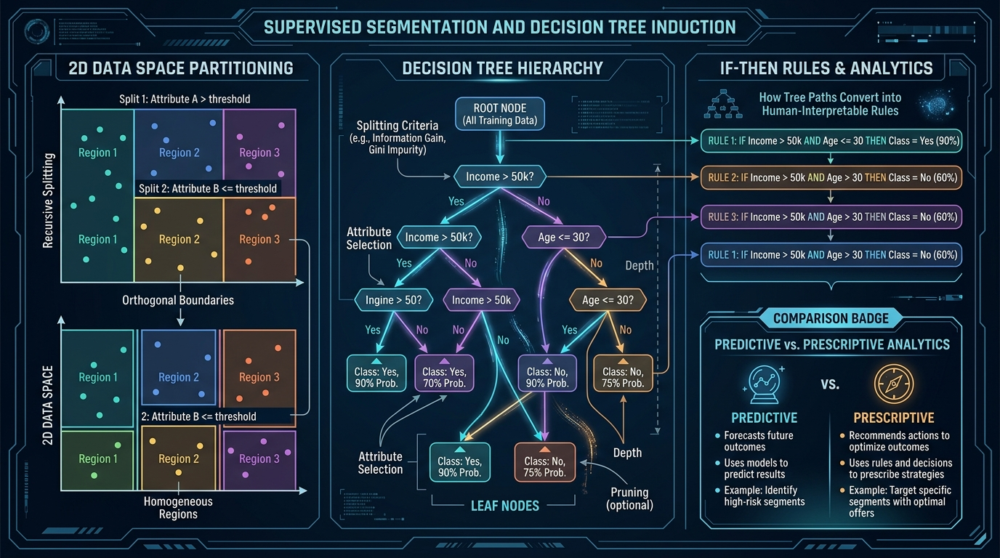
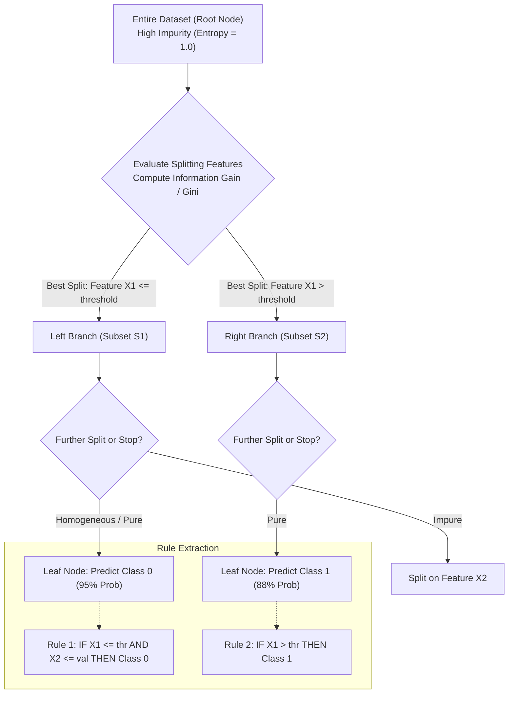

# Module 3: Predictive & Prescriptive Analytics
> **Sessions Covered:** Sessions 13, 14, 15, 16, 17, 18, 19, 20  
> **Total Time:** 16T + 16L = 32 Hours  
> **Target Course:** Data Analytics (PGCP-AI, C-DAC ACTS)

---

## 📌 High-Yield "Nano" Takeaways (Exam Rapid-Recall)
- **Predictive vs. Prescriptive:**
  - *Predictive Analytics:* Forecasts the future state: *"What will happen?"* (e.g., probability of machine failure = 84%).
  - *Prescriptive Analytics:* Recommends optimal intervention: *"What should we do?"* (e.g., reschedule manufacturing jobs to Machine B to maximize total yield while minimizing repair costs).
- **Tree Splitting Criteria:**
  - **Entropy:** $H(S) = -\sum_{i=1}^{c} p_i \log_2(p_i)$ (Measures impurity/disorder; range: $[0, 1]$ for binary).
  - **Information Gain:** $IG(S, A) = H(S) - \sum \frac{|S_v|}{|S|} H(S_v)$ (Reduction in entropy after splitting on attribute $A$).
  - **Gini Impurity:** $Gini(S) = 1 - \sum p_i^2$ (Computationally faster, used by CART in Scikit-learn).
- **Linear Regression Assumptions (LINE):**
  1. **L**inearity: Relationship between $X$ and $Y$ is linear.
  2. **I**ndependence: Observations and residuals are independent (no autocorrelation).
  3. **N**ormality: Residuals are normally distributed ($\epsilon \sim \mathcal{N}(0, \sigma^2)$).
  4. **E**qual Variance (Homoscedasticity): Constant variance of errors across all levels of $X$.
- **Model Goodness of Fit:**
  $$R^2 = 1 - \frac{SS_{\text{res}}}{SS_{\text{tot}}} = 1 - \frac{\sum (y_i - \hat{y}_i)^2}{\sum (y_i - \bar{y})^2}$$
  Adjusted $R^2$ penalizes adding irrelevant independent features.
- **Optimization Core Components:**
  1. **Objective Function:** Maximize profit or minimize cost (e.g., $\max Z = c_1 x_1 + c_2 x_2$).
  2. **Decision Variables:** Quantities to be decided ($x_1, x_2 \ge 0$).
  3. **Constraints:** Resource limits, capacities, or requirements ($a_{11} x_1 + a_{12} x_2 \le b_1$).

---

## 🖼️ Architectural Diagram: Supervised Segmentation & Decision Trees





---

## 📖 Deep-Dive Theory & Conceptual Walkthrough

### Session 13: Predictive Modelling & Analysis Overview
*(Hours: 2 Theory + 2 Lab)*

Predictive modeling utilizes historical statistical patterns to estimate future outcomes.
- **Types of Predictive Models:**
  - *Classification:* Categorical target (e.g., Loan Default: Yes/No; Medical diagnosis).
  - *Regression:* Continuous numerical target (e.g., House Price prediction, Stock revenue).
- **Benefits:** Proactive operational planning, automated risk underwriting, personalized customer recommendations.
- **Challenges & Pitfalls:**
  - Garbage-in, Garbage-out (poor data quality).
  - Concept drift (market behaviors change over time).
  - Black-box opacity vs. regulatory requirements (e.g., credit scoring laws requiring explainability).

---

### Sessions 14, 15 & 16: Supervised Segmentation & Decision Trees
*(Hours: 6 Theory + 6 Lab)*

#### 1. Supervised Segmentation
Supervised segmentation partitions the feature space into homogeneous regions with respect to a target label. Rather than random grouping, it systematically selects the attribute that separates classes most effectively.

#### 2. Mathematical Splitting Criteria
Suppose a binary dataset has 10 positive and 10 negative examples ($p_+ = 0.5, p_- = 0.5$):
- **Initial Entropy:**
  $$H(S) = -(0.5 \log_2 0.5 + 0.5 \log_2 0.5) = 1.0 \text{ bit (Maximum impurity)}$$
- If a split divides it into two completely pure subsets (10 positive in one, 10 negative in the other):
  $$H(S_{\text{pure}}) = -(1.0 \log_2 1.0 + 0) = 0.0 \text{ bits (Complete purity)}$$
  $$\text{Information Gain} = 1.0 - 0.0 = 1.0 \text{ bit (Optimal split!)}$$

#### 3. Decision Trees as Rules & Probability Estimation
Each path from the root node to a leaf translates directly into an `IF-THEN` rule:
$$\text{IF } (\text{Income} > \$60k) \text{ AND } (\text{CreditScore} > 700) \implies \text{Approve Loan (Probability: } 94\%)$$
Decision trees can output class probabilities based on the proportion of training instances belonging to that class in the terminal leaf node.

#### 4. Prescriptive Modelling
While predictive models answer *"What is the probability this patient readmits?"*, prescriptive models determine: *"What treatment dosage and follow-up protocol minimizes readmission risk while minimizing treatment cost?"*
- Prescriptive models couple predictive probability outputs with mathematical optimization constraints.

---

### Sessions 17 & 18: Regression Analysis & Forecasting
*(Hours: 4 Theory + 4 Lab)*

#### 1. Simple vs. Multiple Linear Regression
- **Simple Linear Regression:** $Y = \beta_0 + \beta_1 X + \epsilon$
- **Multiple Linear Regression:** $Y = \beta_0 + \beta_1 X_1 + \beta_2 X_2 + \dots + \beta_k X_k + \epsilon$
- **Ordinary Least Squares (OLS) Criterion:** Finds coefficients $\beta$ that minimize the Sum of Squared Residuals ($SSR$):
  $$SSR = \sum_{i=1}^{n} (y_i - \hat{y}_i)^2$$

#### 2. Multicollinearity & Variance Inflation Factor (VIF)
When independent variables are highly correlated with each other, coefficient estimates become unstable:
$$VIF_j = \frac{1}{1 - R_j^2}$$
- $VIF > 5$ to $10$ indicates severe multicollinearity requiring feature removal or regularization (Ridge/Lasso).

---

### Sessions 19 & 20: Simulation & Optimization
*(Hours: 4 Theory + 4 Lab)*

#### 1. Monte Carlo Simulation
Used when systems are subject to significant uncertainty and non-linear risk. By drawing thousands of random draws from known probability distributions for inputs, we build an empirical probability distribution for the outcome (e.g., project budget overrun probability).

#### 2. Linear Programming (LP)
Mathematical method to achieve the best outcome (such as maximum profit or lowest cost) in a mathematical model whose requirements are represented by linear relationships:
$$\begin{aligned}
\text{Maximize: } & Z = 50x_1 + 40x_2 \\
\text{Subject to: } & 2x_1 + 3x_2 \le 100 \quad \text{(Raw Material constraint)} \\
& 4x_1 + 2x_2 \le 120 \quad \text{(Labor Hours constraint)} \\
& x_1, x_2 \ge 0 \quad \text{(Non-negativity)}
\end{aligned}$$

---

## 💻 Practical Code Lab: Decision Trees, Multiple Regression & Simulation

```python
"""
Sessions 13-20 Lab: Decision Tree Induction, Multiple Regression, and Monte Carlo Simulation
Prerequisites: pip install numpy pandas scikit-learn scipy matplotlib
"""
import numpy as np
import pandas as pd
from sklearn.datasets import make_classification
from sklearn.tree import DecisionTreeClassifier, export_text
from sklearn.model_selection import train_test_split
from sklearn.linear_model import LinearRegression
from sklearn.metrics import r2_score, mean_squared_error
from scipy.optimize import linprog

np.random.seed(42)

# ==============================================================
# 1. DECISION TREE INDUCTION & RULE EXTRACTION (Sessions 14-16)
# ==============================================================
X, y = make_classification(
    n_samples=300, n_features=4, n_informative=3, n_redundant=0,
    random_state=42
)
feature_names = ['AccountAge', 'TxnCount', 'AvgBalance', 'CreditScore']
df_tree = pd.DataFrame(X, columns=feature_names)

X_train, X_test, y_train, y_test = train_test_split(df_tree, y, test_size=0.25, random_state=42)

# Fit Decision Tree with Gini Impurity and controlled depth (avoid overfitting)
clf = DecisionTreeClassifier(criterion='gini', max_depth=3, random_state=42)
clf.fit(X_train, y_train)

print("=== DECISION TREE INDUCTION: EXTRACTED RULES ===")
tree_rules = export_text(clf, feature_names=feature_names)
print(tree_rules)

# Predict class probabilities for test samples
sample_probs = clf.predict_proba(X_test[:3])
print("Predicted Class Probabilities for first 3 test instances:")
print(sample_probs)

# ==============================================================
# 2. MULTIPLE LINEAR REGRESSION (Sessions 17-18)
# ==============================================================
n = 200
X1 = np.random.uniform(10, 50, n)
X2 = np.random.uniform(1, 10, n)
# Ground truth: Y = 15 + 2.5*X1 - 4.2*X2 + noise
Y = 15 + 2.5 * X1 - 4.2 * X2 + np.random.normal(0, 3.0, n)

X_reg = np.column_stack([X1, X2])
reg_model = LinearRegression()
reg_model.fit(X_reg, Y)

y_pred = reg_model.predict(X_reg)
r2 = r2_score(Y, y_pred)
rmse = np.sqrt(mean_squared_error(Y, y_pred))

print("\n=== MULTIPLE LINEAR REGRESSION RESULTS ===")
print(f"Intercept (Beta_0): {reg_model.intercept_:.3f}")
print(f"Coefficients (Beta_1, Beta_2): {reg_model.coef_[0]:.3f}, {reg_model.coef_[1]:.3f}")
print(f"R-squared: {r2:.4f} | RMSE: {rmse:.4f}")

# ==============================================================
# 3. LINEAR PROGRAMMING OPTIMIZATION (Sessions 19-20)
# ==============================================================
# Maximize Profit: Z = 50*x1 + 40*x2  -> In linprog, minimize -Z: [-50, -40]
c = [-50, -40]
# Inequality constraints (LHS <= RHS)
# 2*x1 + 3*x2 <= 100
# 4*x1 + 2*x2 <= 120
A = [[2, 3], [4, 2]]
b = [100, 120]
x_bounds = (0, None)  # x1 >= 0, x2 >= 0

opt_result = linprog(c, A_ub=A, b_ub=b, bounds=[x_bounds, x_bounds], method='highs')

print("\n=== PRESCRIPTIVE ANALYTICS: LINEAR OPTIMIZATION ===")
print(f"Optimal Units of Product 1 (x1): {opt_result.x[0]:.2f}")
print(f"Optimal Units of Product 2 (x2): {opt_result.x[1]:.2f}")
print(f"Maximum Profit: ${-opt_result.fun:.2f}")
```

---

## 🎯 Lab Exam & Viva Questions
1. **Q:** *Why do we prefer decision tree pruning or setting `max_depth`?*  
   **A:** An unconstrained decision tree will split until every leaf is 100% pure, effectively memorizing training noise, leading to catastrophic overfitting and poor generalization on unseen test data.
2. **Q:** *What is the difference between $R^2$ and Adjusted $R^2$?*  
   **A:** $R^2$ monotonically increases whenever a new feature is added, even if that feature is completely useless noise. Adjusted $R^2$ includes a degrees-of-freedom penalty for every additional predictor, only increasing if the new feature genuinely improves explanatory power.
3. **Q:** *How does Prescriptive Analytics build on Predictive Analytics?*  
   **A:** Predictive analytics outputs future likelihoods or forecasts. Prescriptive analytics takes those predictions as parameters into an optimization algorithm or decision rule framework to recommend the mathematically optimal action under business constraints.
