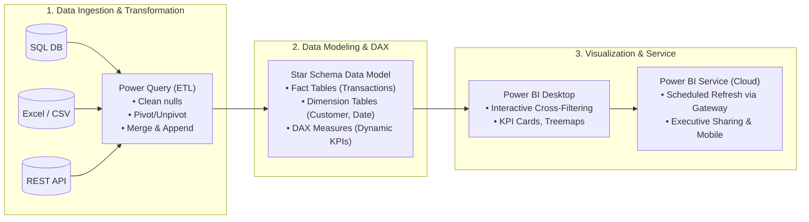

# Module 4: Model Evaluation, Advanced Analytics & Power BI
> **Sessions Covered:** Sessions 21, 22, 23, 24, 25  
> **Total Time:** 10T + 10L = 20 Hours  
> **Target Course:** Data Analytics (PGCP-AI, C-DAC ACTS)

---

## 📌 High-Yield "Nano" Takeaways (Exam Rapid-Recall)
- **Bias-Variance Tradeoff:**
  - *High Bias (Underfitting):* Model is too simple; makes strong erroneous assumptions; low training and low testing accuracy.
  - *High Variance (Overfitting):* Model memorizes training noise; very high training accuracy but poor generalization to test data.
- **Classifier Evaluation Metric Cheat-Sheet:**
  - $\text{Accuracy} = \frac{TP + TN}{TP + TN + FP + FN}$ (Misleading under class imbalance!)
  - $\text{Precision} = \frac{TP}{TP + FP}$ (Focus: Minimize False Positives, e.g., Spam detection).
  - $\text{Recall / Sensitivity} = \frac{TP}{TP + FN}$ (Focus: Minimize False Negatives, e.g., Cancer/Fraud detection).
  - $\text{Specificity} = \frac{TN}{TN + FP}$ (True Negative Rate).
  - $\text{F1-Score} = 2 \times \frac{\text{Precision} \times \text{Recall}}{\text{Precision} + \text{Recall}}$ (Harmonic mean balancing precision and recall).
  - $\text{ROC-AUC:}$ Plots $\text{TPR}$ (Recall) against $\text{FPR} = (1 - \text{Specificity})$ across all classification thresholds. AUC = 0.5 is random chance; AUC = 1.0 is perfect discrimination.
- **Power BI Core Architecture:**
  - **Power Query:** Mashup engine (M-language) for ETL (extract, clean, pivot, unpivot, filter).
  - **Data Model (VertiPaq Engine):** In-memory columnar database organizing Star Schema (Fact vs. Dimension tables).
  - **DAX (Data Analysis Expressions):** Formula language for dynamic Calculated Columns and Measures.

---

## 🖼️ Architectural Diagrams

### 1. Classifier Evaluation & Decision Analytics


### 2. End-to-End Power BI BI & ETL Pipeline




---

## 📖 Deep-Dive Theory & Conceptual Walkthrough

### Session 21: Overfitting & Validation Strategies
*(Hours: 2 Theory + 2 Lab)*

#### 1. The Generalization Problem
The primary goal of machine learning is to perform well on *unseen future instances*, not merely replicate known training records.
- **Symptoms of Overfitting:** $99\%$ accuracy on Train set, but $68\%$ on Test set.
- **Mitigation Techniques:**
  - Cross-validation.
  - Early stopping.
  - Regularization ($L_1$ Lasso, $L_2$ Ridge penalties).
  - Tree pruning (limiting `max_depth` or `min_samples_split`).

#### 2. Cross-Validation Schemes
- **Holdout Validation:** Split dataset into Train (70%), Validation (15%), and Test (15%). Fast, but sample-sensitive.
- **$K$-Fold Cross-Validation:** Partition data into $K$ equal subsets (folds). Train on $K-1$ folds and validate on the remaining fold; repeat $K$ times and average the scores.
- **Stratified $K$-Fold:** Guarantees that each fold contains approximately the same percentage of each target class as the complete dataset (crucial for imbalanced data).

---

### Session 22: Decision Analytics & Classifier Economics
*(Hours: 2 Theory + 2 Lab)*

#### 1. Beyond Standard Evaluation: The Cost-Benefit Matrix
In real-world business, false positives and false negatives carry vastly different financial costs:
- **Medical Screening:** A False Negative (missing a tumor) is catastrophic (loss of life). A False Positive causes temporary anxiety and an inexpensive follow-up biopsy. We prioritize **Recall**.
- **Spam Filtering:** A False Positive (sending an important job offer to spam) is far worse than a False Negative (seeing a spam email in the inbox). We prioritize **Precision**.

#### 2. Expected Value Framework for Data Investments
$$\text{Expected Value} = P(Y=1) \cdot [p_{\text{pred}} \cdot b(TP) + (1 - p_{\text{pred}}) \cdot c(FN)] + P(Y=0) \cdot [p_{\text{pred}} \cdot c(FP) + (1 - p_{\text{pred}}) \cdot b(TN)]$$
Businesses justify investments in data pipelines and model accuracy when the expected net profit gains outweigh model development and computational costs.

---

### Session 23: Evidence Combination & Probabilistic Reasoning
*(Hours: 2 Theory + 2 Lab)*

#### 1. Sequential Evidence Updating via Bayes' Rule
When multiple independent pieces of evidence $E_1, E_2, \dots, E_k$ arrive over time:
$$P(H | E_1, E_2) \propto P(H) \times P(E_1|H) \times P(E_2|H)$$
The posterior probability after observing $E_1$ becomes the prior probability for the next stage when observing $E_2$.
- **Probabilistic Graphical Models (Bayesian Networks):** Directed acyclic graphs (DAGs) representing conditional dependencies between variables.

---

### Session 24: Factor Analysis & High-Dimensional Analytics
*(Hours: 2 Theory + 2 Lab)*

#### 1. Dimensionality Reduction Overview
When dealing with hundreds of correlated features (Curse of Dimensionality), models suffer from high variance and computational drag.
- **Principal Component Analysis (PCA):** Unsupervised linear orthogonal transformation projecting data onto principal axes maximizing total variance.
- **Factor Analysis (FA):** Latent variable technique assuming that observed variables are linear combinations of unobserved latent factors plus error:
  $$X_i = \lambda_{i1} F_1 + \lambda_{i2} F_2 + \dots + \epsilon_i$$
  *Example:* In customer surveys, 20 questionnaire answers might distill into 3 underlying psychological factors: "Brand Loyalty", "Price Sensitivity", and "Tech Savviness".

#### 2. Directional & Functional Data Analysis
- **Directional Data:** Data representing angles, compass directions, or cyclic periodic phenomena (e.g., wind directions, diurnal cycles) where standard Euclidean arithmetic fails ($359^\circ$ and $1^\circ$ are only $2^\circ$ apart, not $358^\circ$).
- **Functional Data Analysis (FDA):** Treats data points as continuous mathematical curves or functions over time rather than discrete isolated measurements (e.g., continuous heart rate curves).

---

### Session 25: Business Intelligence with Power BI
*(Hours: 2 Theory + 2 Lab)*

#### 1. The Modern Power BI Ecosystem
1. **Power BI Desktop:** Free authoring application used to connect to data, model relationships, write DAX calculations, and build interactive dashboards.
2. **Power BI Service:** Cloud SaaS platform for publishing reports, dashboard collaboration, scheduling automated dataset refreshes, and managing row-level security (RLS).
3. **Power BI Mobile:** Mobile native app for monitoring live KPIs on iOS and Android.

#### 2. Power Query (ETL Engine) Best Practices
- Remove unnecessary columns early to optimize VertiPaq columnar compression.
- Replace nulls with sensible defaults or filter corrupted rows.
- Use **Merge** (equivalent to SQL `JOIN`) and **Append** (equivalent to SQL `UNION ALL`).
- Ensure all datatypes are strictly formatted (Dates, Currency, Integers).

#### 3. Data Modeling & Star Schema
- **Fact Tables:** Contain numerical transaction measurements and foreign keys (e.g., `Sales_Amount`, `Quantity`, `OrderDate_FK`, `Customer_FK`). Tall and narrow.
- **Dimension Tables:** Contain descriptive attributes providing context for slicing and filtering (e.g., `Dim_Customer`, `Dim_Product`, `Dim_Date`). Short and wide.
- **Star Schema vs. Snowflake Schema:** Star schema (one-to-many direct relationships from dimension to fact) is the gold-standard recommendation for fast Power BI performance.

#### 4. DAX Essentials: Measures vs. Calculated Columns
- **Calculated Column:** Evaluated row-by-row during data refresh and stored physically in RAM. (e.g., `Profit = Sales[Revenue] - Sales[Cost]`).
- **DAX Measure:** Evaluated dynamically at query-time based on the user's active visual filter context. Consumes zero RAM. (e.g., `Total Sales = SUM(Sales[Revenue])`).

---

## 💻 Practical Code Lab: Model Evaluation, Cross-Validation & PCA

```python
"""
Sessions 21-24 Lab: Stratified K-Fold, Evaluation Metrics, ROC-AUC, and PCA
Prerequisites: pip install numpy pandas scikit-learn matplotlib seaborn
"""
import numpy as np
import pandas as pd
import matplotlib.pyplot as plt
import seaborn as sns
from sklearn.datasets import make_classification
from sklearn.model_selection import StratifiedKFold, cross_val_score
from sklearn.linear_model import LogisticRegression
from sklearn.metrics import confusion_matrix, classification_report, roc_curve, roc_auc_score
from sklearn.decomposition import PCA

np.random.seed(42)

# 1. Generate Synthetic Imbalanced Dataset (Fraud Detection Scenario: 90% Normal, 10% Fraud)
X, y = make_classification(
    n_samples=600, n_features=10, n_informative=5, 
    weights=[0.90, 0.10], random_state=42
)

# 2. Stratified K-Fold Cross-Validation (Session 21)
skf = StratifiedKFold(n_splits=5, shuffle=True, random_state=42)
model = LogisticRegression(solver='liblinear')

cv_scores = cross_val_score(model, X, y, cv=skf, scoring='f1')
print(f"=== 5-FOLD STRATIFIED CV F1-SCORES ===")
print(f"F1-Scores per fold: {cv_scores.round(3)}")
print(f"Mean F1: {cv_scores.mean():.3f} (+/- {cv_scores.std():.3f})")

# 3. Model Training & Comprehensive Classifier Evaluation (Session 22)
train_idx, test_idx = next(skf.split(X, y))
X_train, X_test = X[train_idx], X[test_idx]
y_train, y_test = y[train_idx], y[test_idx]

model.fit(X_train, y_train)
y_pred = model.predict(X_test)
y_prob = model.predict_proba(X_test)[:, 1]

# Confusion Matrix
cm = confusion_matrix(y_test, y_pred)
print("\n=== CONFUSION MATRIX ===")
print(f"TN: {cm[0,0]} | FP: {cm[0,1]}")
print(f"FN: {cm[1,0]} | TP: {cm[1,1]}")

print("\n=== DETAILED CLASSIFICATION REPORT ===")
print(classification_report(y_test, y_pred, target_names=['Normal (0)', 'Fraud (1)']))

# ROC-AUC Calculation
auc_score = roc_auc_score(y_test, y_prob)
fpr, tpr, thresholds = roc_curve(y_test, y_prob)
print(f"ROC-AUC Score: {auc_score:.4f}")

# 4. Dimensionality Reduction via PCA (Session 24)
pca = PCA(n_components=2)
X_pca = pca.fit_transform(X)

print("\n=== PRINCIPAL COMPONENT ANALYSIS (PCA) ===")
print(f"Variance explained by Component 1: {pca.explained_variance_ratio_[0]*100:.2f}%")
print(f"Variance explained by Component 2: {pca.explained_variance_ratio_[1]*100:.2f}%")
print(f"Total 2D Variance Preserved: {np.sum(pca.explained_variance_ratio_)*100:.2f}%")
```

---

## 🎯 Lab Exam & Viva Questions
1. **Q:** *Why is Accuracy a misleading metric for imbalanced classification problems?*  
   **A:** If 99% of transactions are legitimate and only 1% are fraudulent, a naive classifier that predicts "legitimate" 100% of the time achieves 99% accuracy while having a 0% fraud detection rate (0% Recall), completely failing its business objective.
2. **Q:** *What is the difference between a Calculated Column and a Measure in Power BI?*  
   **A:** A Calculated Column is computed row-by-row during data refresh and stored statically in the tabular model in RAM. A Measure is calculated dynamically at visual query time based on the active slicers and filter context, conserving RAM and offering maximum interactivity.
3. **Q:** *How does PCA differ conceptually from Factor Analysis?*  
   **A:** PCA is an empirical data reduction technique that finds linear combinations of variables that maximize overall variance without assuming an underlying model. Factor Analysis models observed variables as manifestations of unobservable, latent constructs plus unique error terms.
